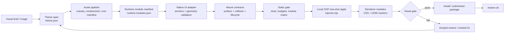
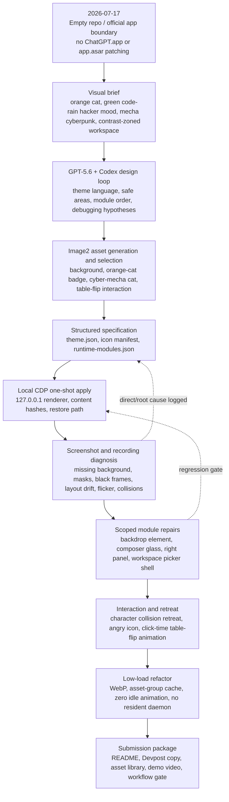

# Codex Dream Skin Workflow Engine

Codex Dream Skin is a local, reversible workflow engine for personalizing the
Codex desktop interface on macOS. It turns a visual brief into a structured
theme specification, optimizes assets, applies selected modules through local
Chromium DevTools Protocol access, verifies geometry and interaction safety,
and restores the native interface without patching the official app.

## Build Week Positioning

- Primary category: Developer Tools
- Impact lens: Work and Productivity
- Supported platform for this submission: macOS
- Runtime boundary: local CDP on `127.0.0.1`

The project demonstrates safe developer-environment personalization rather than
a static CSS skin. The current cyber-mecha cat theme is the sample theme used to
prove the workflow.

No prompt engineering template is required. A user can begin with an incomplete
idea, explore alternatives with Codex, refine individual elements, select a
scene, and progressively assemble a tested interactive workspace. The
architecture is the control plane that keeps this open-ended design process
inside explicit module, geometry, performance, and restore boundaries.

## Related Work And Independent Implementation

The public outcome of
[Fei-Away/Codex-Dream-Skin](https://github.com/Fei-Away/Codex-Dream-Skin) was
reviewed as a feasibility and product reference before implementation. No code
or visual asset from that repository is copied, vendored, or required by this
project. This repository independently implements its local CDP bridge,
native-surface discovery, geometry validation, collision retreat, event policy,
lazy animation lifecycle, payload caching, verification, and restore path.

The engineering work began where a static visual result stopped: determining
which native Codex surface owns each treatment without covering text, changing
hitboxes, leaking through transient panels, or adding a high-frequency runtime.

## Safety Model

- Does not modify `/Applications/ChatGPT.app`
- Does not patch `app.asar`
- Does not alter code signatures
- Does not read or write authentication files, API keys, base URLs, or model
  settings
- Keeps theme state in user-local support directories
- Provides an explicit restore path

## Architecture

```text
Visual brief
  -> theme specification
  -> asset pipeline
  -> runtime module manifest
  -> native UI adapter and mount contracts
  -> placement, collision, and lifecycle policy
  -> static tests and payload budget
  -> one-shot CDP apply
  -> visual and interaction verification
  -> install or restore
  -> submission evidence
```

Runtime ownership is split across:

- `macos/assets/theme.json`: theme values and enabled modules
- `macos/assets/runtime-modules.json`: module policies, payload groups, and
  budgets
- `macos/assets/theme.css`: stable visual surfaces
- `macos/assets/renderer-inject.js`: idempotent DOM markers, retreat behavior,
  manual animation lifecycle, and cleanup
- `macos/scripts/injector.mjs`: CDP transfer, content-hash cache, verification,
  and screenshots

## Architecture Diagram



## Native Mount Model

| Plane | Mount rule | Examples |
|-------|------------|----------|
| Scene | Paint only on the document body; never cover content with a full-workspace overlay | Background image and low-cost color layers |
| Native surface | Mark and style the real Codex node in place; do not recreate its geometry | Sidebar, composer, conversation bubbles, project panel |
| Independent decoration | Attach a body-level, pointer-safe element with explicit safe areas and retreat rules | Cyber-mecha character and small badge |
| Transient portal | Detect the visible shell after an interaction, mark only that shell, and clean it when closed | Dialog, menu, listbox, workspace picker |
| Manual interaction | Keep only the trigger idle; create playback state after click and release it after completion | Table-flip cat animation |

## Tech Stack

| Layer | Technology / File | Role |
|-------|-------------------|------|
| Desktop app | macOS Codex desktop / `/Applications/ChatGPT.app` | Official app being themed; this project does not modify it |
| Runtime bridge | Chromium DevTools Protocol on `127.0.0.1` | Connects only to the local renderer for one-shot apply, verification, and restore |
| CLI / scripts | Bash + Node.js ESM | Installation, launch policy, CDP connection, payload transfer, and tests |
| Theme schema | `macos/assets/theme.json` | Palette, modes, assets, characters, buttons, and module switches |
| Module policy | `macos/assets/runtime-modules.json` | Activation rules, payload groups, event policy, and performance budgets |
| Visual layer | `macos/assets/theme.css` | Sidebar, composer, right panel, conversation, glass material, and borders |
| Renderer logic | `macos/assets/renderer-inject.js` | Idempotent DOM markers, character retreat, manual animation lifecycle, low-frequency maintenance, and cleanup |
| Asset formats | PNG / WebP / SVG / sprite / GIF fallback | Backgrounds, generated cyber-mecha cat, pet-themed glyphs, and manual animation assets |
| Verification | `macos/tests/run-tests.sh`, `verify.sh`, workflow gate | Syntax checks, budgets, interaction checks, screenshots, restore, and regression gates |
| Submission | `submission/`, `competition-manifest.json` | Devpost copy, asset library, demo video package, and public release boundaries |

## Module Ownership

| Module | Responsibility | Load Policy |
|--------|----------------|-------------|
| `background` | Work-safe background and left/right visual zoning | Active theme only |
| `iconBadge` | Sidebar badge and small orange-cat marker | Enabled only |
| `buttonGlyphs` | Abstract pet/cat semantic button glyphs | Opt-in module |
| `character` | Large cyber-mecha cat foreground character | Enabled only |
| `characterRetreat` | Collision retreat when text or panels need space | No extra asset |
| `composerSurface` | Native-size composer glass and edge material | Stable CSS-owned surface |
| `conversationSurface` | Chat bubble readability and edge treatment | Message-scoped surface |
| `workspacePickers` | Attachment/tool picker opacity and anti-bleed shell | Event-triggered, short hold |
| `projectPanels` | Right environment/source panel chrome and rows | Panel-scoped DOM class |
| `tableFlipCat` | Angry trigger icon and table-flip animation | Click-time load, release after playback |

## Development Process Framework

This diagram is derived from the sanitized public `docs/PROJECT_LOG.md`, not from memory. It shows
how the project moved from a single visual theme idea into a modular,
testable, reversible workflow engine.



## Codex And GPT-5.6 Usage Evidence

OpenAI Build Week requires projects to use Codex and GPT-5.6 in a meaningful
way. The project records that usage as part of the engineering workflow rather
than as a label added after the fact.

| Stage | Codex / GPT-5.6 Contribution | Evidence |
|-------|------------------------------|----------|
| Visual decomposition | Converted the orange-cat, hacker, mecha, cyberpunk, and contrast references into safe areas, module sequencing, and theme language | `2026-07-17 22:36 Theme Background Asset`, `2026-07-18 00:15 Closeout Governance` |
| Image generation and selection | Assisted prompt/variant selection and Image2-generated original assets for the cyber-mecha cat family, orange-cat badge, and animation direction | `2026-07-19 10:45 Stage 1 Provenance Correction`, `2026-07-19 10:50 Generated Character Family Correction`, `submission/asset-inventory.json` |
| Visual debugging | Diagnosed screenshots and recordings for missing backgrounds, black frames, text bleed, transparency errors, and composer flicker | `2026-07-17 23:27`, `2026-07-19 Composer Black Frame Historical Trace`, `2026-07-19 Composer Native Floor Fade Removal` |
| Animation lifecycle | Refactored the table-flip cat from preloaded/resident animation into click-time load, CSS playback, completion cleanup, and payload release | `2026-07-19 Modular Runtime Compression And Lazy Animation Closeout` |
| Collision retreat | Designed the cyber-mecha cat retreat system so decoration gives way to text and side panels | `2026-07-19 Mecha Character Retreat Recovery Stabilization` |
| Performance reduction | Guided WebP conversion, asset group hashing, no idle animation, no live blur, no fixed wallpaper, and one-shot launcher policy | `2026-07-19 Runtime Badge Asset Right-Sizing`, `2026-07-19 Low-GPU Glass Composition And Live Probe`, `2026-07-19 Subtractive Effects, Opaque Transients, And One-Shot Launcher` |
| Workflow packaging | Consolidated generation, theming, debugging, verification, restore, and submission into one reusable skill and workflow gate | `2026-07-19 09:39 Build Week Unified Workflow Framework`, `.agents/skills/codex-dream-skin-workflow/` |

Official references:

- [OpenAI Build Week Official Rules](https://openai.devpost.com/rules)
- [OpenAI Build Week FAQ](https://openai.devpost.com/details/faqs)

## Quick Test For Judges

Run from the repository root:

```bash
bash .agents/skills/codex-dream-skin-workflow/scripts/workflow-gate.sh --runtime
bash macos/scripts/install.sh
bash macos/scripts/start.sh --no-launch --once --port 9341 --wait-ms 8000
bash macos/scripts/verify.sh --port 9341
bash macos/scripts/restore.sh --port 9341
```

If Codex is not already running with the local CDP port, launch the installed
`Codex Dream Skin.app` launcher after `install-launcher.sh`. The launcher uses
one-shot application and does not leave a resident injector daemon.

## Demo Materials

- Public demo video: [YouTube](https://youtu.be/5viFZCJ57TQ)
- English subtitle file: `submission/demo/codex-dream-skin-demo-short-en.srt`
- Caption authoring file: `submission/demo/codex-dream-skin-demo-short-en.ass`
- Mouse timeline: `submission/demo/demo-timeline.json`
- Public storyboard frames: `submission/demo/storyboard-frames.html`
- Asset inventory: `submission/asset-inventory.json`
- Public release checklist: `submission/submission-checklist.md`

## Performance Boundaries

The current optimized runtime removes live backdrop blur, fixed wallpaper
attachment, idle theme animation, and resident table-flip playback assets. The
manual animation payload is loaded only after the user clicks the trigger and is
released after playback.

The runtime gate checks CSS, renderer code, module budgets, launchers,
one-shot policy, table-flip lifecycle, and restore compatibility.

## Restore

To remove the theme from the active renderer:

```bash
bash macos/scripts/restore.sh --port 9341
```

To remove the theme and quit the CDP-launched Codex session:

```bash
bash macos/scripts/restore.sh --quit
```

## License And Provenance

Code is released under the MIT License. Visual asset provenance and exclusion
rules are recorded in `CREDITS.md`, `NOTICE.md`, and
`submission/asset-inventory.json`.
