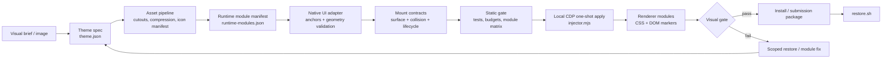
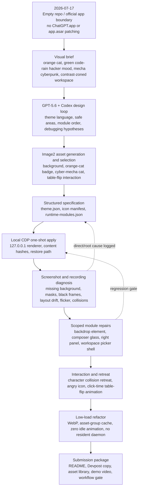

# Codex Dream Skin Workflow Engine

This repository is two things at once: a working interface theming engine for
the Codex desktop app on macOS, and a **Codex / GPT-5.6 capability boundary
test**. Neither is subordinate to the other — the test is only meaningful
because the subject demands real engineering depth.

**The engineering** is not a CSS skin but an eleven-stage pipeline with two
feedback loops: visual brief → structured theme specification → asset pipeline
(cutout, compression, icon manifest) → module manifest with content hashes →
native UI adapter with geometry validation → mount contract (surface, collision,
lifecycle) → static gate (376 assertions, asset budgets, module matrix) →
one-shot local CDP apply → renderer modules → visual verification → install or
scoped restore. Failures write direct and root cause back into the
specification, and module repairs pass through a regression gate.

**The test** was handing all of that — architecture, implementation, asset
pipeline, verification, packaging — to the model, with the user supplying only
intent, constraints, defect reports, and final judgment, to see how far it goes
and where it breaks. Owner's estimate: roughly 20–30% user, 70–80% model; see
the split table below.

The five capabilities under test do not appear in a plain generation task: CDP
injection with a guaranteed restore path, DOM ownership replacement, static
inspection, memory release, and dynamic retreat.

Runtime boundary: CSS and lightweight DOM state are injected over the Chromium
DevTools Protocol on `127.0.0.1`, never modifying the official
`/Applications/ChatGPT.app`, its `app.asar`, its signature, or the user session.

## Not Only a Desktop Skin


The technical subject is the detection, practice, and static inspection of two
things:

1. **Page data-layer CDP injection.** A one-shot attach over the Chromium
   DevTools Protocol on `127.0.0.1` that never modifies the application bundle,
   its signature, or the user session, and always keeps a full restore path.
2. **DOM ownership identification.** Deciding which native node actually owns
   each effect, then replacing that owner without changing hitboxes, covering
   text, or letting transient panels bleed through, instead of stacking another
   overlay on top.

Both have an offline static path. `macos/scripts/static-black-layer-index.mjs`,
`static-interactive-black-layer-index.mjs`, and
`static-color-baseline-compare.mjs` read only source files such as `theme.css`,
`renderer-inject.js`, `surface-registry.js`, and `runtime-modules.json` to index
layer owners and colour baselines. No debug port, no running application, and no
screenshot is required.

## Five Capabilities Under Test

Implementation was handed to GPT-5.6 in full; the user supplied intent,
constraints, and final judgment. The test was whether these five could be driven
to something usable:

| Capability | Requirement | Implementation |
|---|---|---|
| **CDP** | Attach on `127.0.0.1` and inject once, never modifying the application bundle, its signature, or the session, and always keeping a full restore path | `macos/scripts/injector.mjs`, `restore.sh`, `verify.sh` |
| **DOM ownership** | Decide which native node owns an effect and replace that owner rather than stacking an overlay; never change a hitbox, cover text, or let a transient panel bleed through | `macos/assets/surface-registry.js`, owner marking in `renderer-inject.js` |
| **Static access** | Index layer owners and colour baselines from source alone, with no debug port, no running application, and no screenshot; plus a runtime DOM cache that avoids repeated queries | `static-black-layer-index.mjs`, `static-interactive-black-layer-index.mjs`, `static-color-baseline-compare.mjs`; module `staticAccess` (`kind: dom-cache`) |
| **Memory release** | One-shot animation: load from cache only on click, then clear the timer, drop the playing class and deadline attribute, and `node.remove()` the playback node, leaving no resident animation and no idle loop; group assets by content hash and prune stale groups | `releaseTableFlipPlaybackNode()`, lazy `loadGroup()`, `assetGroupsPruned`; module `tableFlipCat` (`loadPolicy: static-cache-click`) |
| **Dynamic retreat** | Character and decoration layers must yield to the composer, panels, and text using live geometry, with bounded collision checks and no unbounded polling | `characterRetreat` (`kind: dom-geometry`) and `collisionScheduler` (`kind: scheduler`), both `loadPolicy: no-extra-asset` |

None of this rests on assertion alone: `macos/tests/run-tests.sh` carries 376
checks against the identifiers and bounds above, `module-boundary-gate.mjs`
verifies the module boundary declarations, and `performance-probe.mjs` measures
runtime load.

The load ceilings are declared and gate-enforced rather than self-imposed:

| Artifact | Current | Ceiling | Used |
|---|---|---|---|
| `theme.css` | 83,170 B | 130,000 B | 64.0% |
| `renderer-inject.js` | 116,581 B | 120,000 B | 97.2% |

Exceeding either is an error in `macos/scripts/module-matrix.mjs`. The `policy`
block in `runtime-modules.json` additionally fixes `rendererMaintenanceMs` at
2500 and `heavyMaintenanceMs` at 10000, forbids idle backdrop blur and per-icon
filter stacks, and restricts asset loading to what enabled modules actually
reference.

## Human and Model Contribution Split

The figures below are the project owner's first-hand estimate from the actual
collaboration. They are **not measured**. They are published for attribution
transparency; the measurable parts — implementation size, verification
coverage, evidence-layer density — are in
[docs/CODEX_CAPABILITY_BOUNDARY_TEST.md](docs/CODEX_CAPABILITY_BOUNDARY_TEST.md).

| Stage | User input | Codex / GPT-5.6 output | Estimated split |
|---|---|---|---|
| Starting definition | Asked for a Codex desktop skin / Dream Skin | Judged that it should become a restorable runtime engine | User 70% / Codex 30% |
| Visual direction | Orange cat, hacker, Matrix, cyberpunk, mecha, clashing colour | Decomposed into theme language, safe area, colour roles, module order | User 45% / Codex 55% |
| Asset generation | A few screenshots, references, aesthetic direction | Generated backgrounds, character, badge, table-flip asset variants | User 25% / Codex 75% |
| Cutout and asset processing | Asked for clean, usable, non-occluding | Built chroma / cutout / runtime sizing, checked alpha | User 10% / Codex 90% |
| Runtime architecture | Asked that Codex not be broken | Designed CDP one-shot injection, restore, verify, engine/state layering | User 15% / Codex 85% |
| Screenshot and layer debugging | Reported black frames, occlusion, unclean edges | Scanned DOM, layers, owner boundary, direct and root cause | User 20% / Codex 80% |
| Click and interaction verification | Asked that it stay clickable, unobstructed, confirmed | Sidebar, composer, right panel, workspace picker, table-flip lifecycle tests | User 10% / Codex 90% |
| Animation lifecycle | Wanted an interactive effect | Moved to click-time load, release after playback, no resident animation | User 15% / Codex 85% |
| Performance governance | Asked that it not stutter or interfere | WebP, content-hash cache, removed blur / idle animation / daemon | User 10% / Codex 90% |
| Build Week submission | Decided to enter, gave final judgment | README, Devpost copy, asset inventory, demo timeline, judge path | User 25% / Codex 75% |

**Overall: roughly 20–30% user, 70–80% Codex / GPT-5.6.**

Put precisely: the user contributed intent, taste, constraints, approval,
defect reports, and final judgment; Codex / GPT-5.6 contributed architecture,
implementation, the asset pipeline, cutout validation, click testing, layer
scanning, performance optimisation, the restore path, and submission packaging.

## Self-checking, Self-repairing Loop

`docs/PINNED_REVISION_LOOP_STANDARD.md` defines a re-entrant loop:

```text
ORIENT -> CDP_CHECK -> SCAN_QUEUE -> LAYER_CLASSIFY -> decision
  decision: protect native / replace owner / consolidate selector / rescan route
  -> STATIC_GATE (syntax, tests, workflow gate, diff check)
  -> budget check (compress before applying when over budget)
  -> APPLY_ONCE (one-shot injection, no resident daemon)
  -> VERIFY (live DOM scan, screenshot, route state, pixel audit)
```

A failed verification returns to owner replacement for another pass. A lost
debug port records a blocker instead of making any live claim. A screenshot that
does not match the route forces a rescan rather than accepting stale evidence.
`macos/scripts/revision-loop-one-click.sh` is the single entry point. The loop is
a documented decision procedure re-run by a person or an agent, not a daemon
that retries by itself.

## Transferable Scope

The same path is not limited to theming:

- **Web page data-layer detection.** CDP attachment plus DOM ownership
  identification can inventory what a page actually renders, which node owns it,
  what is mounted dynamically, and which regions are natively protected.
- **Data-layer structure inventory, the same class of problem as crawling.**
  `interface-field-inventory.mjs` inventories interface fields and dynamic
  boundary coverage, `live-surface-audit.mjs` audits the running renderer over
  CDP, and `native-module-scan.mjs` samples native modules over time. Identify
  the structure first, then decide what to read, is the shared problem.

The boundary is explicit: this project operates only over local loopback against
the user's own application, with an additional `chatgpt|codex` target allowlist.
It sends no request to any external site and ships no capability to fetch or
store third-party web content. The scope above describes where the technique
transfers, not a crawler bundled with this repository.

## Build Week Positioning

- Primary category: Developer Tools
- Impact lens: Work and Productivity
- Supported platform for this submission: macOS
- Runtime boundary: local CDP on `127.0.0.1`
- Submission framing: a working theming workflow engine that is **also** a
  capability boundary test. The engineering depth and the test value are
  conditions for each other — a soft subject would make the test meaningless,
  and a model that could not carry it would leave no tool.
- Evidence: the contribution split is in the table below; the measured
  implementation size, verification coverage, and evidence-layer density are in
  [docs/CODEX_CAPABILITY_BOUNDARY_TEST.md](docs/CODEX_CAPABILITY_BOUNDARY_TEST.md),
  pinned to commit `e9bd85e` so they stay reproducible.

The project demonstrates safe developer-environment personalization rather than
a static CSS skin. The cyber-mecha cat theme is the sample used to exercise and
prove the workflow; the workflow itself is the product.

No prompt engineering template is required. A user can begin with an incomplete
idea, explore alternatives with Codex, refine individual elements, select a
scene, and progressively assemble a tested interactive workspace. The
architecture is the control plane that keeps this open-ended design process
inside explicit module, geometry, performance, and restore boundaries.

## Related Work And Independent Implementation

The public outcome of
[Fei-Away/Codex-Dream-Skin](https://github.com/Fei-Away/Codex-Dream-Skin) was
reviewed as a feasibility and product reference before implementation. No code
or visual asset from that repository is copied, vendored, or required by this
project. This repository independently implements its local CDP bridge,
native-surface discovery, geometry validation, collision retreat, event policy,
lazy animation lifecycle, payload caching, verification, and restore path.

The engineering work began where a static visual result stopped: determining
which native Codex surface owns each treatment without covering text, changing
hitboxes, leaking through transient panels, or adding a high-frequency runtime.

## Safety Model

- Does not modify `/Applications/ChatGPT.app`
- Does not patch `app.asar`
- Does not alter code signatures
- Does not read or write authentication files, API keys, base URLs, or model
  settings
- Keeps theme state in user-local support directories
- Provides an explicit restore path

## Architecture

```text
Visual brief
  -> theme specification
  -> asset pipeline
  -> runtime module manifest
  -> native UI adapter and mount contracts
  -> placement, collision, and lifecycle policy
  -> static tests and payload budget
  -> one-shot CDP apply
  -> visual and interaction verification
  -> install or restore
  -> submission evidence
```

Runtime ownership is split across:

- `macos/assets/theme.json`: theme values and enabled modules
- `macos/assets/runtime-modules.json`: module policies, payload groups, and
  budgets
- `macos/assets/theme.css`: stable visual surfaces
- `macos/assets/renderer-inject.js`: idempotent DOM markers, retreat behavior,
  manual animation lifecycle, and cleanup
- `macos/scripts/injector.mjs`: CDP transfer, content-hash cache, verification,
  and screenshots

## Architecture Diagram


```mermaid
flowchart LR
  A["Visual brief / image"] --> B["Theme spec<br/>theme.json"]
  B --> C["Asset pipeline<br/>cutouts, compression, icon manifest"]
  C --> D["Runtime module manifest<br/>runtime-modules.json"]
  D --> E["Native UI adapter<br/>anchors + geometry validation"]
  E --> F["Mount contracts<br/>surface + collision + lifecycle"]
  F --> G["Static gate<br/>tests, budgets, module matrix"]
  G --> H["Local CDP one-shot apply<br/>injector.mjs"]
  H --> I["Renderer modules<br/>CSS + DOM markers"]
  I --> J{"Visual gate"}
  J -->|pass| K["Install / submission package"]
  J -->|fail| L["Scoped restore / module fix"]
  L --> B
  K --> M["restore.sh"]
```

## Native Mount Model

| Plane | Mount rule | Examples |
|-------|------------|----------|
| Scene | Paint only on the document body; never cover content with a full-workspace overlay | Background image and low-cost color layers |
| Native surface | Mark and style the real Codex node in place; do not recreate its geometry | Sidebar, composer, conversation bubbles, project panel |
| Independent decoration | Attach a body-level, pointer-safe element with explicit safe areas and retreat rules | Cyber-mecha character and small badge |
| Transient portal | Detect the visible shell after an interaction, mark only that shell, and clean it when closed | Dialog, menu, listbox, workspace picker |
| Manual interaction | Keep only the trigger idle; create playback state after click and release it after completion | Table-flip cat animation |

## Tech Stack

| Layer | Technology / File | Role |
|-------|-------------------|------|
| Desktop app | macOS Codex desktop / `/Applications/ChatGPT.app` | Official app being themed; this project does not modify it |
| Runtime bridge | Chromium DevTools Protocol on `127.0.0.1` | Connects only to the local renderer for one-shot apply, verification, and restore |
| CLI / scripts | Bash + Node.js ESM | Installation, launch policy, CDP connection, payload transfer, and tests |
| Theme schema | `macos/assets/theme.json` | Palette, modes, assets, characters, buttons, and module switches |
| Module policy | `macos/assets/runtime-modules.json` | Activation rules, payload groups, event policy, and performance budgets |
| Visual layer | `macos/assets/theme.css` | Sidebar, composer, right panel, conversation, glass material, and borders |
| Renderer logic | `macos/assets/renderer-inject.js` | Idempotent DOM markers, character retreat, manual animation lifecycle, low-frequency maintenance, and cleanup |
| Asset formats | PNG / WebP / SVG / sprite / GIF fallback | Backgrounds, generated cyber-mecha cat, pet-themed glyphs, and manual animation assets |
| Verification | `macos/tests/run-tests.sh`, `verify.sh`, workflow gate | Syntax checks, budgets, interaction checks, screenshots, restore, and regression gates |
| Submission | `submission/`, `competition-manifest.json` | Devpost copy, asset library, demo video package, and public release boundaries |

## Module Ownership

| Module | Responsibility | Load Policy |
|--------|----------------|-------------|
| `background` | Work-safe background and left/right visual zoning | Active theme only |
| `iconBadge` | Sidebar badge and small orange-cat marker | Enabled only |
| `buttonGlyphs` | Abstract pet/cat semantic button glyphs | Opt-in module |
| `character` | Large cyber-mecha cat foreground character | Enabled only |
| `characterRetreat` | Collision retreat when text or panels need space | No extra asset |
| `composerSurface` | Native-size composer glass and edge material | Stable CSS-owned surface |
| `conversationSurface` | Chat bubble readability and edge treatment | Message-scoped surface |
| `workspacePickers` | Attachment/tool picker opacity and anti-bleed shell | Event-triggered, short hold |
| `projectPanels` | Right environment/source panel chrome and rows | Panel-scoped DOM class |
| `tableFlipCat` | Angry trigger icon and table-flip animation | Click-time load, release after playback |

## Development Process Framework

This diagram is derived from the local development journal `docs/PROJECT_LOG.md`, not from memory. That journal records absolute local paths and screenshot evidence, so it stays local and is not published with this repository. It shows
how the project moved from a single visual theme idea into a modular,
testable, reversible workflow engine.


```mermaid
flowchart TD
  A["2026-07-17<br/>Empty repo / official app boundary<br/>no ChatGPT.app or app.asar patching"] --> B["Visual brief<br/>orange cat, green code-rain hacker mood, mecha cyberpunk, contrast-zoned workspace"]
  B --> C["GPT-5.6 + Codex design loop<br/>theme language, safe areas, module order, debugging hypotheses"]
  C --> D["Image2 asset generation and selection<br/>background, orange-cat badge, cyber-mecha cat, table-flip interaction"]
  D --> E["Structured specification<br/>theme.json, icon manifest, runtime-modules.json"]
  E --> F["Local CDP one-shot apply<br/>127.0.0.1 renderer, content hashes, restore path"]
  F --> G["Screenshot and recording diagnosis<br/>missing background, masks, black frames, layout drift, flicker, collisions"]
  G --> H["Scoped module repairs<br/>backdrop element, composer glass, right panel, workspace picker shell"]
  H --> I["Interaction and retreat<br/>character collision retreat, angry icon, click-time table-flip animation"]
  I --> J["Low-load refactor<br/>WebP, asset-group cache, zero idle animation, no resident daemon"]
  J --> K["Submission package<br/>README, Devpost copy, asset library, demo video, workflow gate"]
  G -. "direct/root cause logged" .-> E
  H -. "regression gate" .-> F
```

## Codex And GPT-5.6 Usage Evidence

OpenAI Build Week requires projects to use Codex and GPT-5.6 in a meaningful
way. The project records that usage as part of the engineering workflow rather
than as a label added after the fact.

| Stage | Codex / GPT-5.6 Contribution | Evidence |
|-------|------------------------------|----------|
| Visual decomposition | Converted the orange-cat, hacker, mecha, cyberpunk, and contrast references into safe areas, module sequencing, and theme language | `2026-07-17 22:36 Theme Background Asset`, `2026-07-18 00:15 Closeout Governance` |
| Image generation and selection | Assisted prompt/variant selection and Image2-generated original assets for the cyber-mecha cat family, orange-cat badge, and animation direction | `2026-07-19 10:45 Stage 1 Provenance Correction`, `2026-07-19 10:50 Generated Character Family Correction`, `submission/asset-inventory.json` |
| Visual debugging | Diagnosed screenshots and recordings for missing backgrounds, black frames, text bleed, transparency errors, and composer flicker | `2026-07-17 23:27`, `2026-07-19 Composer Black Frame Historical Trace`, `2026-07-19 Composer Native Floor Fade Removal` |
| Animation lifecycle | Refactored the table-flip cat from preloaded/resident animation into click-time load, CSS playback, completion cleanup, and payload release | `2026-07-19 Modular Runtime Compression And Lazy Animation Closeout` |
| Collision retreat | Designed the cyber-mecha cat retreat system so decoration gives way to text and side panels | `2026-07-19 Mecha Character Retreat Recovery Stabilization` |
| Performance reduction | Guided WebP conversion, asset group hashing, no idle animation, no live blur, no fixed wallpaper, and one-shot launcher policy | `2026-07-19 Runtime Badge Asset Right-Sizing`, `2026-07-19 Low-GPU Glass Composition And Live Probe`, `2026-07-19 Subtractive Effects, Opaque Transients, And One-Shot Launcher` |
| Workflow packaging | Consolidated generation, theming, debugging, verification, restore, and submission into one reusable skill and workflow gate | `2026-07-19 09:39 Build Week Unified Workflow Framework`, `.agents/skills/codex-dream-skin-workflow/` |

Official references:

- [OpenAI Build Week Official Rules](https://openai.devpost.com/rules)
- [OpenAI Build Week FAQ](https://openai.devpost.com/details/faqs)

## Quick Test For Judges

Run from the repository root:

```bash
bash .agents/skills/codex-dream-skin-workflow/scripts/workflow-gate.sh --runtime
bash macos/scripts/install.sh
bash macos/scripts/start.sh --no-launch --once --port 9341 --wait-ms 8000
bash macos/scripts/verify.sh --port 9341
bash macos/scripts/restore.sh --port 9341
```

If Codex is not already running with the local CDP port, launch the installed
`Codex Dream Skin.app` launcher after `install-launcher.sh`. The launcher uses
one-shot application and does not leave a resident injector daemon.

## Demo Materials

- Public demo video: [YouTube](https://youtu.be/5viFZCJ57TQ)
- English subtitle file: `submission/demo/codex-dream-skin-demo-short-en.srt`
- Caption authoring file: `submission/demo/codex-dream-skin-demo-short-en.ass`
- Mouse timeline: `submission/demo/demo-timeline.json`
- Public storyboard frames: `submission/demo/storyboard-frames.html`
- Asset inventory: `submission/asset-inventory.json`
- Public release checklist: `submission/submission-checklist.md`

## Performance Boundaries

The current optimized runtime removes live backdrop blur, fixed wallpaper
attachment, idle theme animation, and resident table-flip playback assets. The
manual animation payload is loaded only after the user clicks the trigger and is
released after playback.

The runtime gate checks CSS, renderer code, module budgets, launchers,
one-shot policy, table-flip lifecycle, and restore compatibility.

## Restore

To remove the theme from the active renderer:

```bash
bash macos/scripts/restore.sh --port 9341
```

To remove the theme and quit the CDP-launched Codex session:

```bash
bash macos/scripts/restore.sh --quit
```

## License And Provenance

Code is released under the MIT License. Visual asset provenance and exclusion
rules are recorded in `CREDITS.md`, `NOTICE.md`, and
`submission/asset-inventory.json`.
