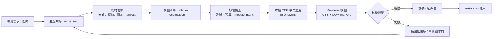
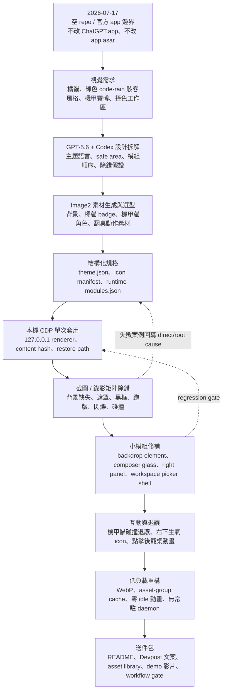

# Codex Interface Theme

English judge copy: [README.en.md](README.en.md)

本專案是給 macOS Codex 桌面端使用的本機介面主題工具。它透過 `127.0.0.1` 上的 Chromium DevTools Protocol 注入 CSS 與輕量 DOM 狀態，不修改官方 `/Applications/ChatGPT.app`、`app.asar`、簽名或使用者登入資料。

## Codex Dream Skin Workflow Engine

Codex Dream Skin 不是單一 CSS 皮膚，而是一套由 Codex 協助運作的主題工作流：把視覺需求轉為結構化 theme spec，處理並壓縮素材，依模組套用，驗證原生介面幾何與互動，最後可完整還原。

OpenAI Build Week 定位：

- 主賽道：`Developer Tools`
- 價值對齊：`Work & Productivity`
- 單一產品：安全主題工具鏈與工作舒適度改善是同一套 workflow 的技術面與使用者價值面，不拆成兩個專案。

統一流程：

```text
需求與圖片
  -> 主題規格
  -> 去背與 runtime 素材最佳化
  -> 獨立模組與內容雜湊
  -> 靜態測試與資產預算
  -> CDP 單次套用
  -> 幾何、可讀性、碰撞與動畫驗證
  -> 接受安裝或範圍化還原
  -> 證據與競賽提交包
```

## 框架圖



## 技術棧

| 層級 | 技術 / 檔案 | 職責 |
|------|-------------|------|
| 桌面端 | macOS Codex desktop / `/Applications/ChatGPT.app` | 被套用主題的官方應用程式；本專案不修改它 |
| Runtime bridge | Chromium DevTools Protocol on `127.0.0.1` | 只連本機 renderer，做一次性注入、驗證與還原 |
| CLI / scripts | Bash + Node.js ESM | 安裝、啟動、CDP 連線、payload 傳輸、驗證 |
| Theme schema | `macos/assets/theme.json` | 主題色、模式、資產、角色、按鈕與模組開關 |
| Module policy | `macos/assets/runtime-modules.json` | 模組啟用條件、payload 群組、效能預算、載入策略 |
| Visual layer | `macos/assets/theme.css` | sidebar、composer、右側面板、泡泡對話、玻璃與邊框樣式 |
| Renderer logic | `macos/assets/renderer-inject.js` | idempotent DOM 標記、角色退讓、手動動畫、低頻維持、cleanup |
| Asset formats | PNG / WebP / SVG / sprite / GIF fallback | 背景、機甲貓、貓系語意圖示、手動動畫 |
| Verification | `macos/tests/run-tests.sh`, `verify.sh`, workflow gate | 語法、預算、互動、截圖、還原與 regression gate |
| Submission | `submission/`, `competition-manifest.json` | Devpost 文案、素材庫、demo 影片、公開打包邊界 |

## 模組邊界

| 模組 | 主要責任 | 載入策略 |
|------|----------|----------|
| `background` | 工作安全區背景與左右視覺分區 | active theme only |
| `iconBadge` | sidebar badge / 小型橘貓標記 | enabled only |
| `buttonGlyphs` | 抽象貓系按鈕圖示 | opt-in module |
| `character` | 大型機甲貓前景角色 | enabled only |
| `characterRetreat` | 右側面板與文字碰撞退讓 | 無額外素材 |
| `composerSurface` | 輸入框玻璃層與邊界 | DOM class |
| `conversationSurface` | 泡泡對話視窗與可讀性保護 | DOM class |
| `workspacePickers` | 工作欄位 picker 黑底 / 防穿透 | 事件觸發，短暫維持 |
| `projectPanels` | 右側環境 / 來源 panel 玻璃與 row 樣式 | DOM class |
| `tableFlipCat` | 右下生氣 icon 與翻桌動畫 | 點擊後載入，播完釋放 |

## 開發歷程框架

這張圖整理自 [docs/PROJECT_LOG.md](docs/PROJECT_LOG.md) 的公開開發摘要，不是事後憑印象重寫。它描述這個專案從「單張主題圖」演進成可驗證、可還原、低負載工作流的實際路徑。



## GPT-5.6 / Codex 使用證據

官方 Build Week 規則要求專案使用 Codex 與 GPT-5.6，demo 影片與 README 也要說明使用方式。FAQ 進一步要求這個使用必須是有意義的，不可以只是裝飾性標註；也可以搭配標準函式庫、框架或其他已授權工具，但 Codex 與 GPT-5.6 要是核心工作的一部分。

本專案的對應證據：

| 階段 | GPT-5.6 / Codex 參與點 | 專案證據 |
|------|-------------------------|----------|
| 視覺拆解 | 把橘貓、綠色 code-rain 駭客風格、機甲與賽博龐克參考拆成主題語言、safe area、撞色分區與模組順序 | `2026-07-17 22:36 Theme Background Asset`, `2026-07-18 00:15 Closeout Governance` |
| 生圖與選型 | 使用 GPT-5.6 輔助 prompt/變體判斷，透過 Image2 生成原創機甲貓、橘貓 badge 與動畫方向，保留來源與 runtime 版本 | `2026-07-19 10:45 Stage 1 Provenance Correction`, `2026-07-19 10:50 Generated Character Family Correction`, `submission/asset-inventory.json` |
| 截圖除錯 | 根據使用者截圖與錄影定位背景沒蓋上、黑框、透明度、文字穿透與 composer 閃爍來源 | `2026-07-17 23:27`, `2026-07-19 Composer Black Frame Historical Trace`, `2026-07-19 Composer Native Floor Fade Removal` |
| 動畫調整 | 把翻桌貓從預載 / 常駐改成右下生氣 icon 點擊後才載入、CSS steps 播放、播完清理 | `2026-07-19 Modular Runtime Compression And Lazy Animation Closeout` |
| 退讓機制 | 用碰撞判斷讓大型機甲貓在文字或右側 panel 侵入時退讓，而不是遮住工作內容 | `2026-07-19 Mecha Character Retreat Recovery Stabilization` |
| 效能優化 | 壓縮背景、換 runtime WebP、分 asset group hash、移除 live blur / fixed wallpaper / idle animation / daemon | `2026-07-19 Runtime Badge Asset Right-Sizing`, `2026-07-19 Low-GPU Glass Composition And Live Probe`, `2026-07-19 Subtractive Effects, Opaque Transients, And One-Shot Launcher` |
| 工作流封裝 | 把生圖、套版、除錯、驗證、還原、送件打包成同一個技能與 gate，而不是散落的一次性腳本 | `2026-07-19 09:39 Build Week Unified Workflow Framework`, `.agents/skills/codex-dream-skin-workflow/` |

官方參考：

- [OpenAI Build Week Official Rules](https://openai.devpost.com/rules)
- [OpenAI Build Week FAQ](https://openai.devpost.com/details/faqs)
- [OpenAI Build Week project update](https://openai.devpost.com/updates/45362-openai-build-week-halfway-there-where-are-you)

專案內 Codex 技能：`$codex-dream-skin-workflow`

```bash
bash .agents/skills/codex-dream-skin-workflow/scripts/workflow-gate.sh --runtime
```

最終送件前使用嚴格模式；只要影片、repository、README、feedback session ID 或 judge path 仍未完成，就會阻擋送件：

```bash
bash .agents/skills/codex-dream-skin-workflow/scripts/workflow-gate.sh --submission
```

目前本機偵測到的官方 app：

- App path: `/Applications/ChatGPT.app`
- Bundle id: `com.openai.codex`
- Bundled Node: `/Applications/ChatGPT.app/Contents/Resources/cua_node/bin/node`

## 安全邊界

- 不讀取或改寫 `~/.codex/auth.json`
- 不修改 `app.asar` 或官方 `.app`
- 不自動改寫 API Key、Base URL 或模型供應商設定
- CDP 僅綁定 `127.0.0.1`
- 主題資料放在 `~/Library/Application Support/CodexInterfaceTheme`
- 安裝後引擎放在 `~/.codex/codex-interface-theme`

## 快速使用

先在本 repo 跑檢查：

```bash
macos/tests/run-tests.sh
```

安裝到固定引擎位置：

```bash
macos/scripts/install.sh
```

安裝固定啟動器到 `~/Applications/Codex Dream Skin.app`：

```bash
macos/scripts/install-launcher.sh
```

之後從 Finder / Spotlight 開啟 `Codex Dream Skin`。啟動器會在 Codex 尚未開啟時，用主題引擎啟動 Codex 並套用 active theme；如果 Codex 已經開著但沒有 debug port，它只會提示，不會強制關閉目前視窗。

手動啟動 Codex 並套用主題。此工具直接執行官方 bundle executable 以保留 CDP 啟動參數，不修改官方 app：

```bash
~/.codex/codex-interface-theme/scripts/start.sh
```

如果 Codex 已經開著，先正常關閉 Codex，或明確要求重啟：

```bash
~/.codex/codex-interface-theme/scripts/start.sh --restart
```

如果官方 app 沒有在 20 秒內回應 graceful quit，才使用：

```bash
~/.codex/codex-interface-theme/scripts/start.sh --restart --force-quit
```

切換模式或套用自己的背景圖：

```bash
~/.codex/codex-interface-theme/scripts/customize.sh --mode sidebar-art
~/.codex/codex-interface-theme/scripts/customize.sh --image "/absolute/path/to/background.png" --name "My Theme" --safe-area sides --task-mode ambient
~/.codex/codex-interface-theme/scripts/start.sh --restart
```

驗證目前 renderer 是否有主題標記：

```bash
~/.codex/codex-interface-theme/scripts/verify.sh
```

不重啟移除目前 renderer 裡的主題層：

```bash
~/.codex/codex-interface-theme/scripts/restore.sh --port 9341
```

若要同時關閉帶 CDP 的 Codex session，使用：

```bash
~/.codex/codex-interface-theme/scripts/restore.sh --quit
```

## 評審快速測試

支援平台：macOS。評審不需要重建官方 Codex 或修改官方 app：

```bash
bash .agents/skills/codex-dream-skin-workflow/scripts/workflow-gate.sh --runtime
bash macos/scripts/install.sh
bash macos/scripts/start.sh --no-launch --once --port 9341 --wait-ms 8000
bash macos/scripts/verify.sh --port 9341
bash macos/scripts/restore.sh --port 9341
```

若 Codex 尚未以本機 CDP port 啟動，才使用已安裝的 `Codex Dream Skin.app` 啟動器。不要為套主題直接修改官方 bundle，也不要在已有可用 renderer 時重啟。

## 設計原則

第一版只做 macOS。原因是目前工作機上確認存在 `com.openai.codex` 的 `/Applications/ChatGPT.app`，而 Windows 的 Store app 啟動、AppUserModelId、路徑 ACL 與 tray 生命週期需要分開設計。

主題分三層：

- `assets/theme.css`：介面外觀與透明/霧化層
- `assets/renderer-inject.js`：renderer 內的 idempotent 注入與還原
- `scripts/injector.mjs`：CDP 連線、注入、驗證、截圖與 daemon

目前主題模式分三種：

- `chrome-only`：只裝飾 sidebar、header、hover、focus、popover 等 Codex 外框區域。
- `sidebar-art`：在 `chrome-only` 基礎上，允許 sidebar 內的去背 icon/badge 與左上角機甲裝甲感角標。
- `wallpaper`：保留給未來安全區完整驗證後使用；目前不作為預設。

預設 source theme 使用 `sidebar-art` 與 `safe-area=sides`。背景圖只會以低透明方式出現在左側 / 右側安全區、sidebar 霧化底層與右側 project/resource panel 底層；main 工作區、conversation、composer 主體仍維持原生可讀，不放全頁壁紙。大型角色是獨立 body 層，放在 sidebar 右側展示區，不壓在功能欄文字後面。

模組化配色欄位放在 `assets/theme.json`：

- `modules.sidebar`：青色系，負責左側導覽與列表辨識。
- `modules.header`：金橘系，負責上方標題列與機甲裝甲感。
- `modules.composer`：低透明黑鈦玻璃底搭配金橘、洋紅、青色薄光漸層，負責輸入區與 focus。
- `modules.popover`：洋紅系，負責選單、彈窗與跳色層。
- `modules.mecha`：黑鈦/槍灰骨架與金橘裝甲語言。
- `modules.status`：success、warning、danger、info 狀態色。

背景圖套件資產：

- `assets/backgrounds/cyber-ruins-pale.png`：淡色賽博廢墟背景，保留中央低對比工作區。
- 舊版 code-rain 橘貓實驗背景：只保留在本地歷史；不列入公開 package。
- 左側安全區使用淡色廢墟、破損面板與微弱資料雨。
- 右側安全區使用廢墟走廊與淡洋紅光，不放角色進背景圖。
- 大型角色使用 `assets/icons/cyber-mecha-cat-male-helmet-900.png`，不透明放在 sidebar 右側展示區。
- 中央工作區不直接鋪圖，避免再次蓋住內容。

去背貓 icon 已包在 `assets/icons/`，並由 `assets/icons/icon-manifest.json` 管理。胖橘貓只能作為 sidebar badge，小型 UI 按鈕只用抽象符號；大型駭客貓角色只能作為 sidebar 右側展示區前景，不可再當作全頁背景，也不可整批貼到每個按鈕。

按鈕圖示採用抽象貓系符號，而不是重複使用橘貓本體：

- `cat-eye-search.svg`：搜尋，貓眼鏡片。
- `cat-paw-new-task.svg`：新增任務，爪掌加號。
- `cat-tail-back.svg` / `cat-tail-forward.svg`：返回/前進，尾巴動線。
- `claw-stop.svg`：停止，爪痕止動。
- `mecha-ear-settings.svg`：設定，機甲貓耳齒輪。
- `neko-chip-project.svg`：專案，貓耳晶片。
- `whisker-send.svg`：送出，鬍鬚飛行線。
- `collar-tag-task.svg`：任務標籤，項圈吊牌。
- `fishbone-files.svg`：檔案/資料，魚骨。
- `yarn-thread.svg`：對話/線程，毛線球。
- `litter-scoop-clean.svg`：清理/整理，貓砂鏟。
- `food-bowl-run.svg`：執行/餵食，食碗。
- `cat-can-package.svg`：套件/封裝，罐頭。
- `teaser-wand-spark.svg`：提示/亮點，逗貓棒。

這組按鈕資產目前只打包在 `assets/icons/buttons/`，`theme.json` 內 `icons.buttons.enabled` 預設為 `false`，不會自動替換 live Codex 按鈕。

按鈕總覽在 [button-glyphs-preview.svg](macos/assets/icons/buttons/button-glyphs-preview.svg)。

目前可本地檢查的模組 preview：

- 側邊導覽：[sidebar-navigation-test.html](macos/previews/sidebar-navigation-test.html)
- 右側資料列：[project-panel-rows-test.html](macos/previews/project-panel-rows-test.html)
- 映射表：[button-action-map.json](macos/assets/icons/button-action-map.json)

第一個測試替換模組是 sidebar navigation。它已具備 sidebar-only runtime 接線，但預設關閉；沒有明確啟用與注入時不會碰 live Codex：

若要準備 sidebar navigation 的 runtime 測試設定，只開第一個模組：

```bash
~/.codex/codex-interface-theme/scripts/customize.sh \
  --icon-buttons-enabled true \
  --icon-buttons-apply-mode module \
  --icon-buttons-sidebar-navigation-enabled true
```

關回預設：

```bash
~/.codex/codex-interface-theme/scripts/customize.sh \
  --icon-buttons-enabled false \
  --icon-buttons-apply-mode opt-in \
  --icon-buttons-sidebar-navigation-enabled false
```

`verify.sh` 會回報 `buttonIcons` 與 `buttonSidebarNavigation`，用來確認 sidebar 模組替換狀態。

第二個測試替換模組是 titlebar navigation，只處理左上可見的返回/前進按鈕。它使用貓尾方向符號和黑金機甲小控制件樣式，預設關閉：

```bash
~/.codex/codex-interface-theme/scripts/customize.sh \
  --icon-buttons-enabled true \
  --icon-buttons-apply-mode module \
  --icon-buttons-sidebar-navigation-enabled true \
  --icon-buttons-titlebar-navigation-enabled true
```

`verify.sh` 會另外回報 `buttonTitlebarNavigation`，期望值是 `2`。

右側資源 / project panel 先做 chrome，不做 icon 替換。它會在 runtime 只標記可見的右側 summary/resource panel，套透明鍵盤外殼、RGB 薄邊線和資料晶片列；`verify.sh` 會回報 `projectPanels`。

composer controls 是輸入區的 icon replacement 模組，只替換輸入區內可見的 `run`、`stop`、`send` 控制，不碰打字框底色、模型選單、聽寫或附件選單。送出/停止按鈕會因狀態改變 label；runtime 只在 composer 範圍內使用右側小按鈕 fallback，不會掃到工作區或右側 panel：

```bash
~/.codex/codex-interface-theme/scripts/customize.sh \
  --icon-buttons-enabled true \
  --icon-buttons-apply-mode module \
  --icon-buttons-sidebar-navigation-enabled true \
  --icon-buttons-titlebar-navigation-enabled true \
  --icon-buttons-composer-controls-enabled true
```

`verify.sh` 會另外回報 `buttonComposerControls`。

top utility actions 是上方工具列 / 面板切換 / 文件工具模組，只替換可見的小型工具按鈕，不碰 sidebar、composer、訊息操作列或 breadcrumb 文字連結。message actions 是訊息區可見操作列模組，只替換 copy、feedback、continue、guide、delete、more、scroll-bottom 等小按鈕，不碰 minimap jump rows。

projectPanelRows 是右側 project/resource panel 內的資料列模組。它必須先看到已標記且完整在 viewport 內的 `.codex-interface-theme-project-panel`，才會替換 row icon；隱藏或偏出畫面外的 panel 會正確回報 `buttonProjectPanelRows = 0`，避免把樣式套到工作區或 offscreen layer。

右側資料列的本地設計預覽在 [project-panel-rows-test.html](macos/previews/project-panel-rows-test.html)。此 preview 只用抽象貓系與寵物用品 glyph，不把橘貓本體貼到 row 上。

可調整的範例：

```bash
~/.codex/codex-interface-theme/scripts/customize.sh \
  --mode sidebar-art \
  --sidebar-accent '#00d5ff' \
  --header-accent '#ffb000' \
  --composer-accent '#ffb000' \
  --composer-surface 'rgba(9, 10, 12, 0.68)' \
  --composer-border 'rgba(255, 176, 0, 0.14)' \
  --popover-accent '#ff4fd8' \
  --mecha-armor '#f2a23a' \
  --image "$PWD/macos/assets/backgrounds/cyber-ruins-pale.png" \
  --safe-area sides \
  --task-mode ambient \
  --icon-badge-enabled true \
  --icon-badge-size 58 \
  --character-enabled true \
  --character-path 'icons/cyber-mecha-cat-male-helmet-900.png' \
  --character-placement sidebar-hero \
  --character-size 350 \
  --character-opacity 1
```

## 專案紀錄

所有 `.md` 檔案與階段決策集中登記在 [docs/PROJECT_LOG.md](docs/PROJECT_LOG.md)。
