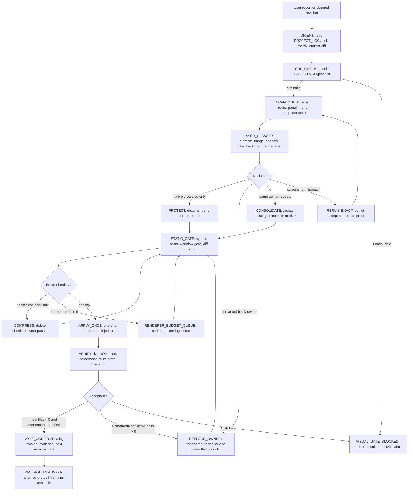
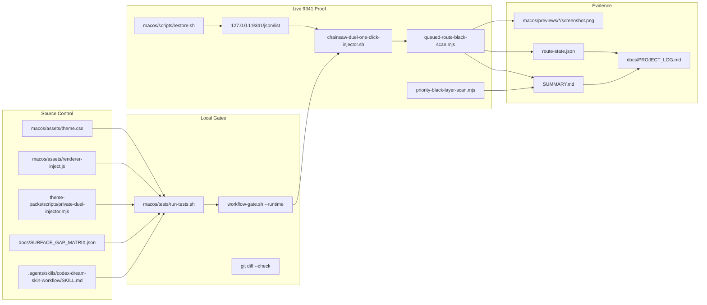

# Pinned Revision Loop Standard

Status: pinned canonical rule
Owner project: Codex Dream Skin Workflow Engine
Last updated: 2026-08-26 02:14 +08:00

This file is the first-read standard after every visual, theme-pack, renderer,
injector, launcher, or packaging revision. It captures the successful path from
the 2026-08-22 to 2026-08-23 black-layer repair and budget-compression loop.

The goal is simple: every revision must be scanned, classified, repaired,
verified, and logged through the same decision path before it is called done.

## Skin Revision Header

This is the project-level header for all future `skin` revisions:

1. Every visual, renderer, injector, theme-pack, launcher, or budget revision
   must first run a parallel comparison before any fill/color repair:
   current source scan, interactive black-layer memory, and baseline color
   comparison.
2. The comparison output must mark the changed owner, file/line, UI state,
   layer kind, and whether the evidence is current source, stored memory, or
   live proof.
3. Fill/color changes are allowed only after that marking step. The repair must
   replace the existing owner rule or owner marker in place.
4. Duplicate or obsolete owner layers must be removed before adding or changing
   material. Compression starts with deleting stale owner passes, not minifying.
5. A screenshot-specific defect must update the reusable owner marker or owner
   rule. Do not append one-off screenshot selectors.
6. The latest comparison artifacts must stay in the `latest-*` preview files,
   and the decision must be recorded in `docs/PROJECT_LOG.md`.

## Non-Negotiable Rules

1. Do not fix black surfaces by stacking new transparent or blur panels.
2. Replace the existing owner rule or owner marker.
3. Scan the exact route or open UI state that was reported.
4. Inspect element background, background image, box shadow, filter,
   backdrop filter, `::before`, and `::after`.
5. Coordinates are evidence only. Ownership comes from DOM ancestry, semantic
   role, native class, theme marker, and interaction state.
6. Do not widen a global selector before proving the owner.
7. If CDP or screenshot proof is unavailable, stop at `VISUAL_GATE_BLOCKED`.
8. Every completed step must update `docs/PROJECT_LOG.md`.
9. Budget compression must delete obsolete owners before considering minify.
10. One-click injection and restore must remain reversible and must not edit the
    official app bundle, `app.asar`, signatures, login state, API keys, or model
    settings.

## Successful Architecture



## Owner Architecture



## Decision Matrix

| Condition | Decision | Required action | Forbidden action |
| --- | --- | --- | --- |
| `9341/json/list` is unavailable | `VISUAL_GATE_BLOCKED` | Record blocker and stop live claims. | Restart or force quit unless explicitly authorized. |
| Exact user route differs from screenshot route | `RERUN_EXACT` | Re-open the exact route and capture fresh proof. | Reuse mismatched screenshot as acceptance. |
| DOM candidate is known protected native surface | `PROTECT` | Document owner and reason. | Repaint browser, iframe, preview, canvas, video, or editor shell globally. |
| `unmarkedNearBlackShells > 0` | `REPLACE_OWNER` | Patch the identified owner rule or marker. | Add a translucent overlay to hide it. |
| Same owner appears in several screenshots | `CONSOLIDATE` | Fold coverage into one owner selector or marker. | Append one new selector per screenshot. |
| `theme.css` approaches 120000 bytes | `COMPRESS` | Delete obsolete owner passes and dead visual branches. | Minify as the first response. |
| `renderer-inject.js` approaches 119500 bytes | `RENDERER_BUDGET_QUEUE` | Shrink runtime logic or move constants out. | Keep adding renderer maintenance branches. |
| Local gates fail | `STATIC_GATE_FAILED` | Fix the failing owner or test before live apply. | Apply to live 9341 anyway. |
| Live scan reports `nearBlack=0`, route-state matches, screenshot matches | `DONE_CONFIRMED` | Log evidence and next resume point. | Package without log evidence. |

## Standard Commands

Preferred one-command post-revision wrapper:

```bash
bash macos/scripts/revision-loop-one-click.sh --port 9341 --open-cdp false
```

Only when the operator explicitly authorizes opening CDP:

```bash
bash macos/scripts/revision-loop-one-click.sh --port 9341 --open-cdp true
```

Read-only CDP check:

```bash
curl -sS http://127.0.0.1:9341/json/list
```

Local gates:

```bash
bash macos/tests/run-tests.sh
bash .agents/skills/codex-dream-skin-workflow/scripts/workflow-gate.sh --runtime
git diff --check
```

One-shot apply to an existing CDP session:

```bash
bash macos/scripts/chainsaw-duel-one-click-injector.sh --port 9341 --open-cdp false --gate true --formal true --private true
```

Exact four-route black-layer scan:

```bash
node macos/scripts/queued-route-black-scan.mjs --port 9341 --labels 外掛程式,已排程,網站,專案 --out-dir macos/previews/revision-loop-four-route-scan --wait-ms 1800
```

Restore current live theme residue:

```bash
bash macos/scripts/restore.sh --port 9341
```

## Required Priority Surfaces

Always scan these first after a visual or CSS change:

| Priority | Surface | Required state |
| --- | --- | --- |
| P1 | Bottom composer and message action strip | Conversation route with composer visible. |
| P2 | Plus or add menu | Composer plus menu open. |
| P3 | Right environment/source bars | Right panel with `環境` and `來源` visible. |
| P4 | Large right browser or command shell | Browser, command palette, or right-side black shell visible. |
| P5 | Route search pages | `外掛程式`, `已排程`, `網站`, `專案`. |
| P6 | Left sidebar selected/open rows | Sidebar route rows and plus buttons visible. |

## Click And Load Layout Stability Contract

Before accepting any click-triggered or load-triggered revision, confirm these
runtime contracts:

1. Click handlers must not wrap native containers, change native layout parents,
   or insert full-screen blocking shells.
2. New runtime-owned click nodes must be mounted only under stable owner
   boundaries: `body`, `#codex-interface-theme-right-hud`, or an already marked
   `codex-interface-theme-*` owner.
3. Any inserted button, trigger, badge, hot-swap bay, or playback node must have
   stable CSS dimensions before interaction; hover, selected, loading, and
   playing states must not resize the native row or toolbar.
4. Click preload/preflight must use bounded timers or animation-frame checks,
   then settle. It must not create unbounded polling, repeated DOM insertion, or
   repeated `replaceChildren()` loops.
5. `workspacePickerHoldUntil`, `projectPanelChromePendingUntil`, and
   `characterRetreatHoldUntil` are hold gates. They prevent flicker during
   drawer/menu transitions and must stay bounded.
6. Table-flip playback is allowed to insert one temporary playback node after
   click, but it must release that node by animation end or timeout fallback.
7. Hot-swap/theme-pack clicks may update CSS variables and owned art nodes, but
   must keep the cycle control anchored by `positionHotSwapBayInLeftSidebar()`.
8. Button glyph installation must hide native SVGs in place; it must not replace
   or resize the native button itself.
9. Load-time body background maintenance must update only owned inline
   background properties and must not append new overlay layers for every load.
10. If screenshot proof is unavailable, classify the state as
    `VISUAL_GATE_BLOCKED`; do not claim that click/load layout is clean.

## Closeout Contract

Each revision must end with one of these states:

| State | Meaning |
| --- | --- |
| `DONE_CONFIRMED` | Static gates passed, live scan passed when available, evidence logged. |
| `STATIC_VERIFIED` | Static gates passed, but live proof is unavailable or not authorized. |
| `VISUAL_GATE_BLOCKED` | CDP, screenshot, route, or required UI state is unavailable. |
| `ROLLBACK_REQUIRED` | Live apply failed or created residue. Restore path must run next. |
| `PRIORITY_INDEX` | Important follow-up is recorded but outside the current safe scope. |

Required log fields:

```text
scope
changed_artifacts
direct_cause
root_cause
fix
validation
evidence_path
budget_before
budget_after
live_revision
blocked_or_not_run
next_resume_point
```

## Current Baseline From Successful Run

- Successful black-layer live revision: `ea804b5fbf4802f0`.
- Four-route post-fix evidence:
  `macos/previews/four-route-black-scan-after-owner-fix-20260823-011656/`.
- Four route DOM result:
  `nearBlack=0`, `unmarked=0`, `protected=0`, `pseudo=0`.
- Successful CSS compression:
  `theme.css` from `129277/130000` to `101527/130000`.
- Renderer compression after wrapper standardization:
  `renderer-inject.js` from `119888/120000` to `113117/120000`.
- Current next budget priority:
  renderer budget is no longer urgent; only revisit it when it approaches
  `119500` again or a runtime gate reports a budget failure.
