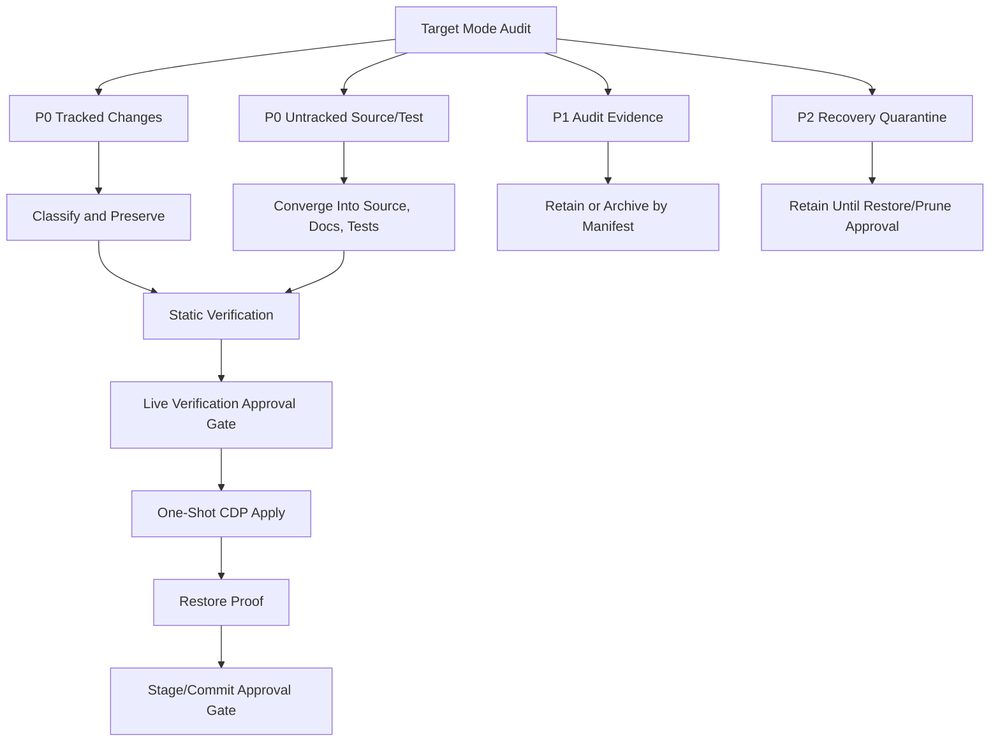

# Target Mode Execution Queue 2026-08-04

This queue controls the remaining target-mode closeout work for Codex Dream
Skin. It is intentionally non-destructive: no delete, restore, launch, CDP
attach, theme apply, click, drag, stage, commit, or package action is allowed
from this queue unless the queue item explicitly says it is approved.

## Plain Summary

現在不是要大改主題。現在要做的是把工作樹收斂乾淨：

- 先確認目前 10 個 tracked 變更是不是都屬於注入/圖層框架必要變更。
- 再把 181 個 untracked source/test 分成「要保留進專案」和「要先留證據」。
- 大量 preview/evidence 先不刪，因為它們是視覺審查證據。
- live apply、restore、stage、commit、封存大型證據，都要先人工審核。

## Control Framework

## Q1 P0 Tracked Changes

Status: `DONE_RETAIN`

Current count: `10`

Decision: preserve until reviewed.

| File | Classification | Reason | Review Needed |
| --- | --- | --- | --- |
| `docs/PROJECT_LOG.md` | project closeout log | Required progress and evidence record. | Before final package only |
| `macos/assets/runtime-modules.json` | architecture contract | Adds boundary policy, owner locks, load modes, style modules, and control-only contract. | Yes, because it is the source of truth |
| `macos/assets/renderer-inject.js` | runtime injection | Adds runtime mode filtering, source/workspace picker narrowing, stale node cleanup, and delayed route phase. | Yes, because it changes injection behavior |
| `macos/assets/theme.css` | visual cleanup | Removes broad global popover/menu/rounded repaint and adds owner-scoped cleanup for sidebar, chat bubble, hot-swap bay, workspace picker, and character retreat. | Visual review before live apply |
| `macos/scripts/common.sh` | source layout guard | Requires split style entries to exist. | Low |
| `macos/scripts/start.sh` | launcher mode routing | Adds launch-only, framework-only, carrier-only, and control-only routing. | Yes, before final user workflow |
| `macos/scripts/injector.mjs` | payload builder and restore guard | Adds assetless load modes, style bundle selection, surface registry injection, and restore sentinel cleanup. | Yes, before live apply |
| `macos/scripts/install-launcher.sh` | launcher installer | Installs offline control workbench and summary viewer launchers. | Low |
| `macos/scripts/module-matrix.mjs` | verification matrix | Verifies style modules, control renderer, source-preview quarantine, composer shell, black-shell transparency, and budgets. | Low |
| `macos/tests/run-tests.sh` | regression gate | Adds checks for target-mode, atomic control, black-shell, source-preview, launcher, and local asset rules. | Low |

Q1 exit criteria:

- Every tracked file has an owner classification.
- No tracked file is treated as disposable cleanup.
- Static checks still pass after queue documentation is written.

## Q2 P0 Untracked Source/Test

Status: `DONE_RETAIN`

Audit count: `181`

Decision: preserve as source or test artifact until converged.

Initial groups:

| Group | Examples | Decision |
| --- | --- | --- |
| docs governance/ledgers | known black ledger, visual governance, surface gap matrix, cleanup manifest, execution queue, live approval queue | Keep and review as project records |
| asset runtime/style entries | `surface-registry.js`, `renderer-control.js`, split CSS entries, visual governance schema | Keep as framework source |
| asset style modules | black-shell, composer shell, source preview quarantine, theme pack frame | Keep as owner-scoped style modules |
| launcher entries | atomic control workbench, dynamic boundary summary viewer | Keep if offline-only contract remains true |
| scripts gates/tools | audit, gate, planner, contract, viewer, cleanup, local asset checks | Keep if read-only or explicitly gated |
| tests/gates | interaction, local asset, cleanup, worktree audit tests | Keep as regression coverage |
| theme packs | generated packs and runtime assets | Review as package payload; do not delete in target mode |

Q2 exit criteria:

- Source/test items are grouped by ownership.
- Preview/evidence files are not mixed into source/test decisions.
- Anything that can mutate live UI remains behind an explicit command gate.

## Q3 P1 Audit Evidence

Status: `DONE_RETAIN`

Audit count: `376`

Size: `695352194` bytes.

Decision: retain as review evidence for now.

Largest retained evidence groups from read-only `du -sk macos/previews/*`:

| Path | Approx Size | Current Decision |
| --- | ---: | --- |
| `macos/previews/full-interface-audit-20260731-140911` | 491600 KiB | Retain until archive manifest is approved |
| `macos/previews/source-preview-before-20260731` | 24348 KiB | Retain as protected source-preview evidence |
| `macos/previews/surface-audit-20260731-1151-followup` | 22596 KiB | Retain as follow-up visual evidence |
| `macos/previews/surface-audit-20260731-1110` | 21428 KiB | Retain as visual evidence |
| `macos/previews/surface-audit-20260731-1114` | 20656 KiB | Retain as visual evidence |
| `macos/previews/video-bar-resize-20260731-142705` | 19348 KiB | Retain as protected resize evidence |
| `macos/previews/native-clickable-audit-20260731-1402` | 18968 KiB | Retain as interaction audit evidence |

Archive proposal:

- Keep all P1 evidence during source/test convergence.
- After live visual verification, create an exact-path archive manifest for
  large preview directories only.
- Archive is allowed only after user approval; deletion is not part of this
  queue.

Needs user review before:

- archiving large preview folders,
- moving evidence out of `macos/previews/`,
- pruning duplicate screenshots or DOM reports.

Q3 exit criteria:

- Produce an archive/retain proposal only.
- Do not move or delete evidence without exact-path approval.

## Q4 P2 Recovery Quarantine

Status: `DONE_RETAIN`

Current journals:

- `.target-mode-quarantine/target-mode-empty-previews-20260803-104731/journal.json`
- `.target-mode-quarantine/target-mode-r1-r2-cleanup-20260804-0529/journal.json`

Decision: retain until explicit restore or reviewed prune.

Journal summary:

| Journal | Items | Content | Decision |
| --- | ---: | --- | --- |
| `target-mode-empty-previews-20260803-104731` | 4 | Empty R2 preview directories | Retain as rollback evidence |
| `target-mode-r1-r2-cleanup-20260804-0529` | 10 | 7 Finder metadata files and 3 empty R2 preview directories | Retain as rollback evidence |

Current proof:

- Target-mode audit reports `R1 Finder metadata candidates: 0`.
- Target-mode audit reports `R2 empty audit directories: 0`.
- Target-mode audit reports `P2 recovery quarantine: 2`.

Q4 exit criteria:

- Confirm quarantine does not leak back into R1/R2.
- Do not prune quarantine without exact-path approval.

## Q5 Live Visual Verification

Status: `PENDING_APPROVAL`

Live verification must use the simple one-shot CDP path only.

Approval artifact:

- `docs/LIVE_VERIFICATION_APPROVAL_QUEUE_20260804.md`

Required scope:

- left sidebar row layer cleanup,
- account/menu row capsule cleanup,
- attachment menu and workspace picker shell,
- right-side panel visual review without fixed-coordinate identity,
- character retreat natural-rect behavior,
- hot-swap control low-interference placement,
- restore proof.

Static prerequisite status:

- `bash .agents/skills/codex-dream-skin-workflow/scripts/workflow-gate.sh
  --runtime`: passed.
- `node macos/scripts/visual-layer-governance-contract.mjs --format text`:
  passed.
- `node macos/scripts/module-boundary-gate.mjs --manifest
  macos/assets/runtime-modules.json --format text`: passed.
- `node macos/scripts/module-matrix.mjs --state-dir
  /tmp/codex-interface-theme-test-state --assets-dir macos/assets --format
  text`: passed.
- `bash macos/tests/run-tests.sh`: passed.
- `offline-live-proof-checklist` reports `completionReady=false` because live
  CDP proof is still approval-gated, not because static verification failed.

Needs user review before:

- connecting to the live Codex CDP target,
- applying any theme to the running Codex UI,
- clicking, dragging, or opening stateful native controls.

Approved movement options:

- A only: read-only live scan.
- A plus B plus C: read-only live scan, one-shot apply, verify/restore.
- Full Q5: read-only live scan, one-shot apply, verify/restore, and scoped
  control-only local proof.

## Q6 Final Closeout

Status: `STATIC_GATES_PASSED_PACKAGE_PENDING`

Release blocker status from `docs/SURFACE_GAP_MATRIX.json`:

| Blocker | Current Decision |
| --- | --- |
| `themeArtStackRightHud.floatingBadgeZOrder` | Needs live visual proof before release/package |
| `liveVisualProof` | Needs approved live proof before release/package |
| `restoreResidueProof` | Needs approved verify/restore evidence before release/package |
| `rendererBudgetPromotion` | Renderer is currently inside budget, but promotion remains indexed until final package review confirms enough margin |

Required gates:

- `node macos/scripts/target-mode-worktree-audit.mjs --format text`
- `node macos/scripts/visual-layer-governance-contract.mjs --format text`
- `node macos/scripts/module-boundary-gate.mjs --manifest macos/assets/runtime-modules.json --format text`
- `node macos/scripts/module-matrix.mjs --state-dir /tmp/codex-interface-theme-test-state --assets-dir macos/assets --format text`
- `bash macos/tests/run-tests.sh`
- `git diff --check`

Needs user review before:

- staging,
- committing,
- packaging,
- deleting,
- pruning quarantine,
- archiving P1 evidence.

## Current Stop Rule

Stop and ask for review only when the next action would:

- mutate live Codex UI,
- launch or attach to CDP,
- click or drag,
- move/delete/archive evidence,
- stage/commit/package,
- change the injection contract in a way that removes an existing mode.
