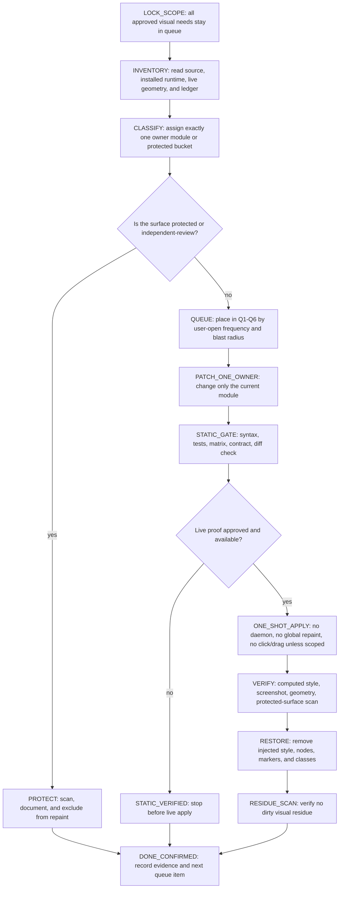
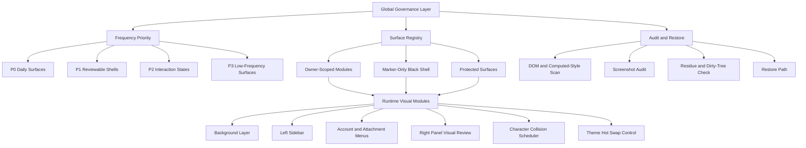

# Visual Modification Governance

This document is the required modification framework for Codex Dream Skin
visual work. It turns the former broad "global theme" idea into a governance
layer: global code may classify, scan, and restore, but it must not repaint
interactive surfaces directly.

## Core Rule

Global ownership is allowed only for governance:

- surface classification
- frequency priority
- protected-surface registry
- screenshot and computed-style audits
- restore and residue cleanup
- project log evidence

Global ownership is not allowed for visual repaint:

- no broad black-surface transparency sweep
- no broad menu, dialog, rounded, border, or button repaint
- no global row background
- no style mutation of browser, iframe, preview, editor, canvas, video, or
  drag/resize surfaces

Every visible change must be owned by a named module or a marker-scoped
surface.

## Full-Demand Scoped State Machine

All user-observed visual defects in the approved scope are real requirements.
Do not collapse the queue to only one item after identifying a smaller defect.
The correct compromise is not "do less"; it is "do every required module in a
bounded order, with one owner and one verification gate at a time."



State meanings:

| State | Meaning | Exit rule |
| --- | --- | --- |
| `LOCK_SCOPE` | The full requested set remains in scope. | Every requirement is mapped to a queue item or protected-review item. |
| `INVENTORY` | Read-only source, installed runtime, DOM, screenshot, and ledger evidence. | Current owner and current drift are known. |
| `CLASSIFY` | The target has one owner module or one protected bucket. | No fixed-coordinate identity and no broad color-only identity remain. |
| `PATCH_ONE_OWNER` | Only the current module may change. | No unrelated CSS, launcher, injector, or global runtime edits. |
| `STATIC_VERIFIED` | Local gates passed, but live proof is absent or not approved. | Must not be called visually complete. |
| `DONE_CONFIRMED` | Static proof, live proof when required, restore, and residue scan are recorded. | `docs/PROJECT_LOG.md` contains evidence and next resume point. |
| `BLOCKED` | A required external state is missing, such as CDP or a manually opened panel. | Record the exact blocker and the next user/action trigger. |

## Step Completion Import Rule

Every queue step must be imported into the project record immediately after it
finishes. Do not wait until the whole batch is complete. A step is not complete
until its status, evidence, and screenshot verification sentence are written.

Required per-step closeout fields:

```text
queue_id
owner_module
changed_files
status
static_gate
live_gate
screenshot_verification_sentence
restore_or_residue_state
next_resume_point
```

Screenshot verification sentence is mandatory:

- If a screenshot exists, write one sentence that states the screenshot path
  and the visual condition it proves.
- If live screenshot verification was not run, write one sentence that says
  `screenshot_verification_sentence: not run` and names the blocker or reason.
- Do not mark `DONE_CONFIRMED` without either a screenshot sentence or an
  explicit not-run sentence.
- Do not reuse old screenshots as proof for a new visual step unless the log
  states why the old screenshot still matches the current revision and surface.

Allowed completion states:

| Status | Meaning |
| --- | --- |
| `QUEUED` | Requirement is accepted but not started. |
| `IN_PROGRESS` | The owner module is being inspected or patched. |
| `STATIC_VERIFIED` | Static gates passed; screenshot/live proof is not yet complete. |
| `LIVE_VERIFIED` | Screenshot/DOM proof exists for the visible state. |
| `RESTORED_VERIFIED` | Restore or residue scan passed after live proof. |
| `DONE_CONFIRMED` | Static proof, live proof when required, restore/residue, screenshot sentence, and log import are complete. |
| `BLOCKED` | The next proof needs external state, such as CDP, a manually opened panel, or user approval. |

When a step changes files, update `docs/PROJECT_LOG.md` in the same step unless
the user explicitly requests no documentation write. Documentation import is
part of the step, not aftercare.

Queue ownership is mandatory:

| Queue | Requirement | Owner boundary | Must not touch |
| --- | --- | --- | --- |
| `Q1` | Clean daily layers: sidebar, account menu, attachment/add menus, chat bubbles, composer shell | owner-scoped CSS or marker-scoped cleanup | right browser/source preview, global black shell |
| `Q2` | Theme hot swap control: low interference and source/live parity | hot-swap module only | character scheduler, account menu, right preview repaint |
| `Q3` | Character collision and retreat stability | character collision scheduler and retreat CSS only | hot-swap placement, global shell, right panel styling |
| `Q4` | Right-side panel, right-top switch, tracking rows, source preview protection | layer-first scanner, registry, protected buckets | coordinate-following repaint, browser/source preview mutation |
| `Q5` | Simple injection closeout | one-shot CDP apply, verify, restore, residue scan | daemon, global injection loop, cloud push |
| `Q6` | Worktree cleanliness and evidence retention | target-mode audit, exact-path cleanup queue, project log | source deletion without exact approval, competition submission |

If one queue item exposes another defect, record that defect in its own queue
slot and return to `CLASSIFY`. Do not repair two owner modules in the same
patch unless the framework explicitly marks one as a dependency of the other.

## Architecture



## Customization Boundary

Dream Skin Forge is a customization engine first. Public packs should prove
that users can swap their own visual language through the same governed
pipeline, not that one fixed theme is the product.

Theme families are separated by intent:

| Family | Purpose | Runtime status |
| --- | --- | --- |
| `animal` | Public-safe demonstration packs with original animal/mecha assets. | May be formal `asset-ready-unmounted` packs after validation. |
| `private-draft` | Local personal experiments for user-owned or private inspiration. | Must stay outside activation lists until promoted. |
| `future-template` | Empty scaffold for other users' custom packs. | May describe schema, but must not ship private assets. |

Promotion rule: private drafts may borrow the same four-layer structure
(`background`, `foreground`, `mascot`, `theme-toggle-icon`), but they do not
become official theme packs until provenance, budgets, alpha validation,
restore, and one-shot visual gates pass.

## Frequency Priority

| Priority | Surfaces | Rule |
| --- | --- | --- |
| P0 | left sidebar, new chat, recent projects, composer, account menu, attachment menu | Must remain clean, readable, and single-layer. Fix visual pollution here first. |
| P1 | right panel shell, section headers, toolbar backgrounds, empty states | May receive one owner-scoped shell layer after visual review. |
| P2 | hover, selected, focus-visible states | May use a faint state layer only. Must not add duplicate borders or large dark blocks. |
| P3 | deep settings, low-frequency plugin pages, uncommon modals | Do not prioritize until P0/P1 surfaces are stable. |

## Surface Decisions

| Surface | Default Decision | Allowed Method | Forbidden Method |
| --- | --- | --- | --- |
| body background | themeable | global background layer only | interactive selector repaint |
| left sidebar rows | themeable with constraints | owner-scoped row state cleanup | global row background, duplicate active border |
| account popover | shell-only | one clean outer shell; transparent rows; faint hover/selected state | per-row dark capsule stack |
| attachment and plugin menus | shell-only | one clean menu shell with protected actions | broad `[role=menu]` descendant repaint |
| right panel shell | reviewable | independent right-panel visual review | global black transparency |
| built-in browser, iframe, source/file preview | protected | inventory and z-index/readability checks only | theme repaint, transparency, blur, forced color |
| canvas, video, image preview, drag/resize handles | protected | collision/readability/interaction audit only | resize, drag, filter, transparency, z-index override |
| composer | themeable with constraints | native-size composer shell module | detached overlay, input interception |
| foreground character | themeable with constraints | collision scheduler with stable natural rect and hysteresis | current-retreated-rect release check |
| hot swap control | themeable with constraints | low-interference status/sidebar placement | main content or right-browser overlay |

## Required Method

Before editing a visual surface:

1. Classify the target surface.
2. Assign exactly one owner module or marker.
3. Check the protected-surface registry.
4. Define the rollback artifact: style id, marker, injected node, or class.
5. Run a live or offline visual audit appropriate to the surface.
6. Record evidence and the next resume point in `docs/PROJECT_LOG.md`.

If a surface cannot be classified, it is protected by default.

## Black Shell Policy

Black shell changes are marker-only.

Allowed:

- `[data-cit-black-shell="true"]`
- owner-registered shell containers
- alpha-only shell material

Forbidden:

- broad black/dark color detection as an apply source
- repainting menus, dialogs, popovers, inputs, editors, previews, composer, or
  sidebar controls through black-shell logic
- classifying protected media or source previews as shell containers

## Known Black Range Gap Ledger

Black-range work must start from a known-range ledger, not from live dynamic
tracking overlays.

Required formula:

```text
known_black_range_total - retained_or_protected_range_total = modification_detection_candidates
```

Definitions:

- `known_black_range_total`: the bounded list of black or near-black ranges
  already observed by screenshot, DOM inventory, or read-only computed-style
  audit.
- `retained_or_protected_range_total`: ranges that must remain native, are
  protected, or require independent visual review.
- `modification_detection_candidates`: the remaining ranges that may enter a
  narrow owner-scoped detection pass.

The ledger must classify every known range into exactly one bucket:

| Bucket | Meaning | Action |
| --- | --- | --- |
| `CONTROLLED` | already owned by a named module or marker | keep current owner and validate residue only |
| `RETAIN_NATIVE` | native state, semantic color, or official control should remain | do not modify; only check readability and overlap |
| `PROTECTED` | browser, preview, media, drag, resize, source, permission, or tracking surface | exclude from black-shell detection |
| `INDEPENDENT_REVIEW` | right panel shell, right-top switch, tracking controls, or other high-risk UI | review as its own owner, not as black-shell fill |
| `MODIFICATION_CANDIDATE` | non-protected black range with a clear owner and rollback path | may proceed to owner-scoped detection |
| `DIRTY_LAYER_SUSPECT` | stacked row capsules, duplicate borders, or legacy broad selector residue | clean by removing the extra layer, not by adding a new black layer |

Forbidden:

- dynamic tracking layers that follow cursor, scroll, route, resize, or live
  DOM churn to discover black ranges
- fixed-coordinate identity detection for right-side surfaces
- mutation observers whose purpose is to continuously add black-range
  candidates
- treating right-top switching controls as black-shell candidates
- treating status, permission, branch, source, preview, browser, iframe,
  canvas, video, drag, or resize controls as modification candidates
- using a broad selector to repair a ledger gap

Allowed:

- read-only screenshot inspection
- read-only DOM and computed-style inventory
- static source/module matrix checks
- one-shot known-range audit after a user-observed state is already open
- manual ledger updates with evidence and a rollback plan

Right-top controls are a separate tracking boundary. Items such as
`open mode`, secondary actions, pin/split toggles, side-panel toggles, source
tabs, branch/status rows, and file-source rows must be classified as
`INDEPENDENT_REVIEW` or `PROTECTED`. They are not counted as
`MODIFICATION_CANDIDATE` unless a future owner module explicitly covers only
their passive shell and proves no state, action, icon, or tracking behavior was
changed.

Right-panel template drift is expected and must be handled separately. If the
right side mixes top switches, source tabs, file rows, environment rows,
branch/status controls, preview thumbnails, or browser/source content in one
template, the whole cluster starts as `INDEPENDENT_REVIEW`. Do not repair this
by subtracting only the visible black color, and do not identify it by fixed
screen coordinates. Use layer-first classification: identify the stable
template parts through DOM ancestry, computed-style layer stack, semantic
signals, role/state attributes, and protected-surface markers:

- `rightTopSwitches`: open mode, secondary actions, pin, split, side-panel
  toggles
- `rightPanelTrackingControls`: active source tabs, selected file/source rows,
  follow/tracking chips
- `rightPanelStatusRows`: environment, branch, PR, push, compare, permission,
  and status rows
- `rightPanelPreviewBlocks`: browser, iframe, source preview, file preview,
  image/video/canvas previews, thumbnails, and resize handles
- `rightPanelPassiveShell`: passive outer panel, passive section background,
  passive section header

Only `rightPanelPassiveShell` may become a future `MODIFICATION_CANDIDATE`.
The other right-panel template parts remain `PROTECTED` or
`INDEPENDENT_REVIEW` until an owner-specific rule exists.

Layer data is the primary evidence. Record the nearest painted ancestor,
theme-owned markers, native class/role/state, pseudo-element paint, background
and shadow layers, and protected child signals before assigning a bucket.
Coordinate data may be recorded as secondary evidence, but it is not identity.
It can only support collision and visual QA after the surface is already
classified by owner, role, state, text-safe label, structural parent, layer
stack, or protected media signal.

Minimum ledger fields:

```text
id
surface_label
rect_or_visual_evidence
current_owner
bucket
reason
allowed_action
forbidden_action
rollback_artifact
evidence_path
next_action
```

No source change may be made from a black-range audit unless the ledger shows
the final candidate count after subtracting retained, protected, and
independent-review ranges.

## Right Panel Visual Review

Right-side UI must be reviewed independently from global background work.

P0 protected checks:

- built-in browser or webview boundary
- iframe boundary
- source preview and file preview
- canvas, video, SVG, image preview
- drag and resize handles
- permission, branch, source, and action rows

P1 reviewable checks:

- outer panel shell
- section headers
- toolbar background
- empty-state background
- selected row state

Right panel visual review must verify that no protected child receives theme
background, transparency, blur, filter, pointer-event mutation, or z-index
override.

## Character Collision Policy

Foreground character retreat must use stable collision logic.

Required:

- detect collision against the character's natural rect, not the already
  retreated rect
- enter retreat quickly after a confirmed collision
- leave retreat only after consecutive clear samples
- use a cooldown window so scroll or layout settling does not cause flicker
- exclude sidebar, composer, right panel, HUD, buttons, SVG, scripts, and style
  nodes from main-text collision scans
- cap scan cost and avoid repeated heavy text walks during animation

Forbidden:

- releasing retreat because the retreated character no longer overlaps text
- using full `main` width as the only collision boundary when the readable
  column is narrower
- scanning dynamic visual surfaces at high frequency during CSS transitions

## Theme Hot Swap Policy

Theme hot swap may stay interactive, but it must not occupy primary content or
right-side preview space.

Allowed locations:

- left status/sidebar low-interference area
- compact launcher or settings-owned control
- collapsed state with explicit user action

Forbidden locations:

- over main text
- over composer
- over right browser or source preview
- over account or permission controls

## Validation Gates

Minimum evidence before a visual change can be considered stable:

- static syntax or matrix validation for changed files
- DOM/computed-style scan for the target surface
- screenshot audit of the target state
- protected-surface audit when right panel, preview, browser, media, drag, or
  resize surfaces are present
- restore or cleanup proof for any injected style, marker, class, or node
- `git diff --check`

Live hotfixes must be labeled as live-only until the same rule is persisted in
source and validated.

## Simple Injection Closeout

The final project state should remain simple:

- design and audit with read-only contracts first
- keep live application as one-shot CDP injection
- verify after apply
- restore with the existing restore command
- scan for residue after restore

Reference contract:

- Schema: `macos/assets/visual-layer-governance-schema.json`
- Checker: `macos/scripts/visual-layer-governance-contract.mjs`
- Static ledger: `docs/KNOWN_BLACK_RANGE_LEDGER.json`

The contract follows the stricter atomic-control pattern: it reports
`connectsToCdp=false`, `appliesTheme=false`, `restores=false`, `clicks=false`,
`drags=false`, `launches=false`, and `mutates=false`. It is a closeout gate, not
the live injector.

Final injection path:

```text
read-only contract -> layer ledger -> one-shot apply -> verify -> restore -> residue scan
```

Do not add a daemon, global repaint overlay, or coordinate-following detector
for closeout. If a future version needs live changes, it must first pass this
contract and then use the existing one-shot CDP apply path.

Modification queue order:

1. `Q1`: clean daily layers: sidebar, account menu, attachment/add menus,
   chat bubbles, and composer shell.
2. `Q2`: hot-swap low-interference placement and source/live parity.
3. `Q3`: character natural-rect collision and retreat stability.
4. `Q4`: right-panel, right-top switch, tracking rows, and source-preview
   protected visual review.
5. `Q5`: simple one-shot injection, verify, restore, and residue scan.
6. `Q6`: worktree cleanliness, evidence retention, and exact-path cleanup
   governance.

Only ledger `MODIFICATION_CANDIDATE`, `DIRTY_LAYER_SUSPECT`, or `CONTROLLED`
surfaces can enter this queue. `PROTECTED`, `RETAIN_NATIVE`, and
`INDEPENDENT_REVIEW` surfaces stay out of simple injection changes.

Q4 implementation rule:

- Prefer CSS-only geometry preservation before adding JS state.
- Retreat may reduce opacity, but it must not translate or scale the character
  if collision release depends on `getBoundingClientRect()`.
- This keeps the measured character rect equal to the natural visual slot and
  avoids self-clearing flicker.

## Closeout Rule

Every completed visual work stage must update `docs/PROJECT_LOG.md` with:

- changed artifacts
- evidence commands and outputs
- skipped validations
- protected surfaces intentionally not modified
- priority-index items
- next resume point

Do not leave visual decisions only in chat.
