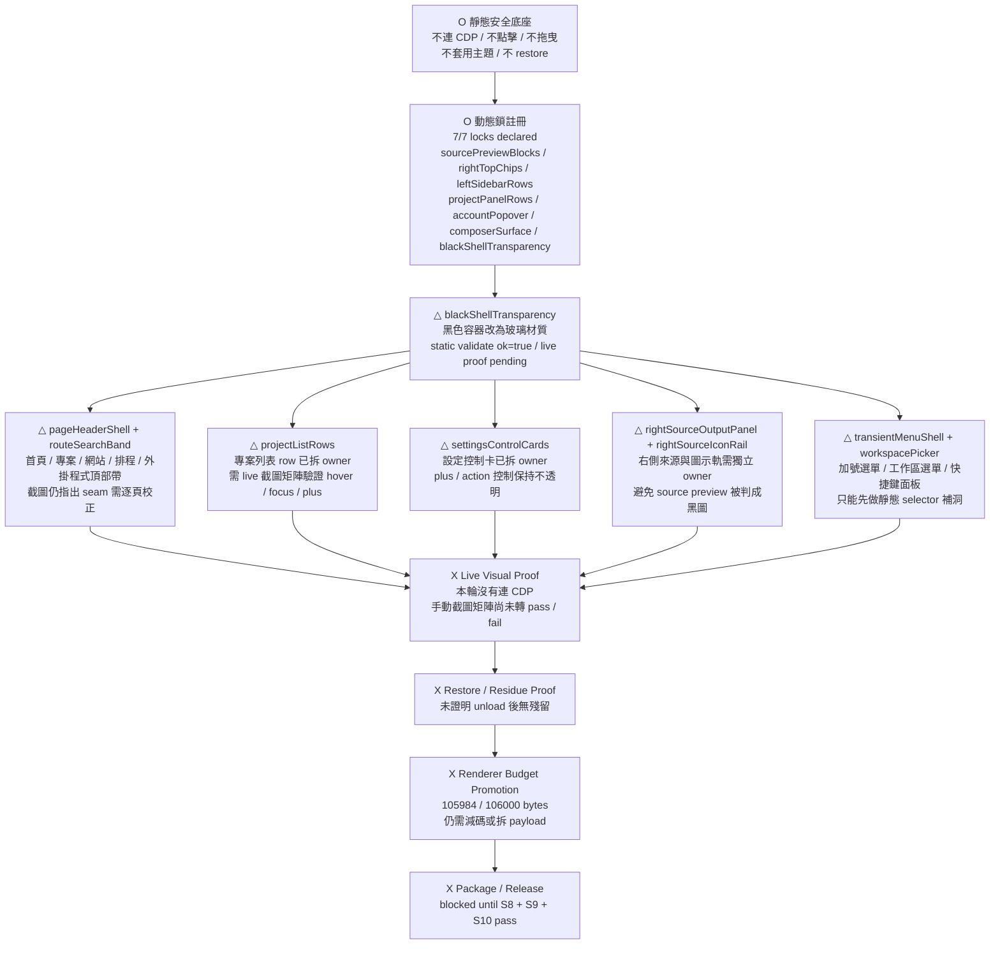
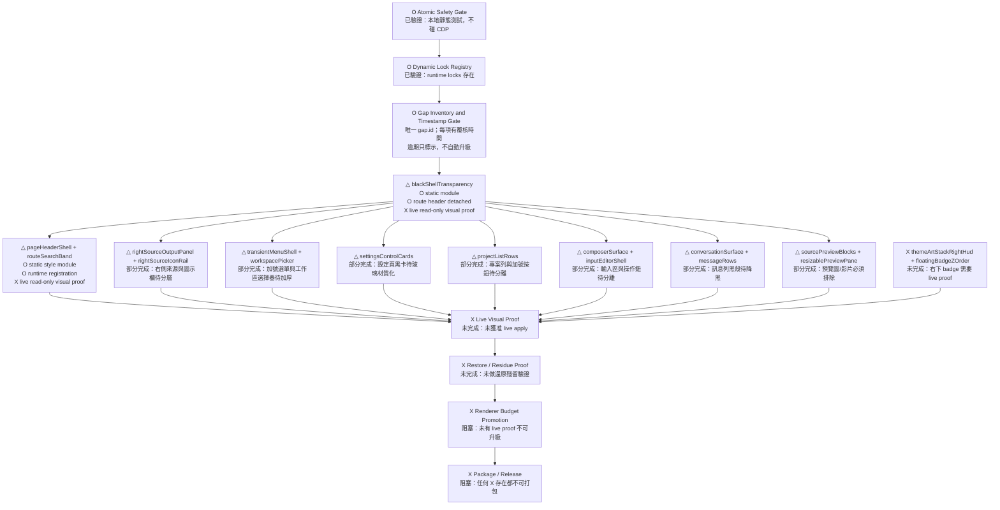
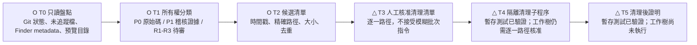

# Personal AI Workbench 架構書

日期：2026-07-26
Owner project：Codex Dream Skin Workflow Engine
狀態：架構基準 + O/△/X 驗證狀態圖

## 目的

Workbench 的目標是把 Codex Desktop 變成單一畫面的工作控制台。它不是
MCP、Raycast、瀏覽器或 IDE 的替代品，而是一層掛在 Codex 視窗內的本地
工作流介面，讓使用者可以在同一個畫面快速找專案、問 Gemini、記錄備忘錄，
並在審核後把內容沉澱成 skill 或 reference。

產品定位：

> Personal AI Workbench for Codex：一個可還原、可控權限、可擴充 adapter
> 的 Codex 側邊工作台，把本地專案、外部 AI 捷徑、備忘錄、未來 MCP
> 工具接進同一個工作畫面。

## 產品邊界

Workbench 負責：

- 在 Codex 左側或下方 sidebar 掛載可收折工具選單。
- 用 `theme.json` 定義工具 registry，並由 runtime defaults 正規化。
- 對指定資料夾建立輕量專案索引與模糊搜尋。
- 提供 Gemini 這類外部 AI 的明確點擊捷徑。
- 提供 memo capture 流程：先寫草稿，再審核後 promote 成 skill 或 reference。
- 提供 runtime 驗證狀態：可見、可點、可還原、未超出 budget。

Workbench 不負責：

- 修改官方 Codex app、`app.asar`、簽章、登入狀態、API key、模型設定或
  backend routing。
- 讀取瀏覽器登入 session、cookie 或隱藏憑證。
- 從 renderer UI 執行任意 shell。
- 把整台電腦變成檔案瀏覽器。
- 未經審核直接修改 active `SKILL.md`。

## 核心原則

1. **單畫面控制，不是整個 app embedding。** 工具以控制件、摘要、索引、
   捷徑呈現。完整外部 app 預設用明確點擊開啟。
2. **先有 adapter 邊界，再加功能。** 每個工具都要宣告 kind、輸入、輸出、
   權限、掛載位置、cleanup 行為。
3. **本地優先，但 fail-closed。** 本地索引由 Node 端 injector 從白名單
   roots 產生，renderer 只收到序列化 metadata，不直接碰 filesystem。
4. **先草稿，再記憶。** memo recording 先寫 capture draft，審核後才
   promote 到 skill reference 或 skill instruction。
5. **沒有隱形自動化。** MVP 只做明確點擊、複製、可見狀態；自動開 app、
   shell 執行、直接改 skill 都是後續階段。
6. **MCP-compatible，不跟 MCP 競爭。** MCP 是模型調工具的協議層；
   Workbench 是人操作的 UI shell，可掛 MCP 工具，也可掛非 MCP 捷徑。
7. **Click-to-wake，release-after-use。** idle 狀態只保留最小 UI 與小型
   metadata；工具被點擊後才喚醒，完成、收折、失焦或 timeout 後必須釋放
   DOM、timer、large payload reference 與 transient state。

## 分層模型

| 層級 | Owner | 責任 |
|---|---|---|
| Theme spec | `macos/assets/theme.json` | 宣告 workbench、placement、tools、search roots、policy。 |
| Defaults and schema | `theme-runtime-defaults.mjs`, `theme-store.mjs` | 補預設值，驗證 URL、path、policy，拒絕不安全設定。 |
| Injection bridge | `injector.mjs` | 建 project index、包 workbench metadata、hash payload groups、重用未變 payload。 |
| Renderer behavior | `renderer-inject.js` | 掛載收折 UI、跑 fuzzy matching、處理明確點擊。 |
| CSS surface | `theme.css` | 樣式化 workbench，不蓋 native text、不攔 unrelated pointer target。 |
| Runtime manifest | `runtime-modules.json` | 宣告 workbench modules、payload keys、event policy、budget、matrix。 |
| Evidence | `run-tests.sh`, workflow gate, project log | 防回歸、記錄決策、標出下一步。 |

## 核心模組

### 1. Workbench Shell

目的：

- 管理可收折 panel frame 與工具切換。
- 把 workbench 視覺上接到 Codex sidebar。
- 預設保持 compact collapsed state。

啟用條件：

- `workbench.enabled === true`
- `workbench.placement === "left-sidebar"`

Runtime 行為：

- 只掛一個 idempotent root element。
- route maintenance 時保留使用者展開/收折狀態。
- collision/text scan 要排除 workbench root。
- restore 時移除所有 nodes、datasets、timers、listeners。

MVP 動作：

- 展開/收折選單。
- 選取 active tool。
- disabled tool 顯示為 planned，不可點擊。

### 2. Tool Registry

目的：

- 讓每個工具都是宣告式 adapter，不是散落在 renderer 的 hardcoded UI。
- 每個 adapter 必須宣告 lifecycle，不得預設常駐。

初始 tool kinds：

| Kind | 意義 | MVP 動作 |
|---|---|---|
| `external-url` | 可信 HTTPS 捷徑，例如 Gemini。 | 明確點擊後開啟。 |
| `local-url` | localhost 工具，例如 Open WebUI、本地 dashboard。 | 預設 disabled，需明確啟用。 |
| `internal-status` | 沒有 URL 的 renderer/payload-backed 工具。 | 切 panel 或顯示 metadata。 |
| `mcp-adapter` | 未來由 MCP server manifest 驅動的 adapter。 | MVP 不實作。 |

Allowlist 規則：

- `external-url` 必須是 HTTPS 且 host 在 allowlist。
- `local-url` 必須在 `127.0.0.1` 或 `localhost`。
- `internal-status` 不可帶 URL。
- `mcp-adapter` 在 server 來源與權限宣告前不可啟用。

Adapter 必填欄位：

- `id`
- `label`
- `kind`
- `enabled`
- `activation`
- `permission`
- `wakePolicy`
- `releasePolicy`
- `maxResidentBytes`
- `timeoutMs`

預設 lifecycle：

- `wakePolicy: "explicit-click"`
- `releasePolicy: "on-collapse-or-timeout"`
- `maxResidentBytes: 262144`
- `timeoutMs: 120000`

## Click-to-Wake Lifecycle

Workbench 的所有工具都採用「點擊喚醒、用完釋放」生命週期。這是產品的核心
輕量化邊界。

```text
idle
  -> user explicit click
  -> wake adapter
  -> load minimal data / open external target / render panel
  -> user completes action or leaves panel
  -> release transient state
  -> return to idle
```

### Idle State

Idle 狀態允許：

- collapsed shell DOM。
- tool button DOM。
- 小型 tool registry metadata。
- 小型 project index summary。
- 最近一次操作狀態字串。

Idle 狀態禁止：

- 大型 retrieval bundle。
- raw chat transcript。
- Notion page full content。
- Gemini prompt full payload。
- 長時間 timer。
- filesystem watcher。
- hidden iframe。
- background agent session。

### Wake State

工具只有在以下條件成立時才可 wake：

- 使用者明確點擊 tool button、search input、record button 或 refresh button。
- adapter `enabled === true`。
- 權限與 allowlist 通過。
- 前一個同類工具已 release 或可被安全替換。

Wake 時可做：

- 讀取已存在的 serialized metadata。
- 建立搜尋結果 DOM。
- 產生 retrieval bundle。
- 打開 external URL。
- 寫入受控 draft 或 ASST inbox row。

Wake 時禁止：

- 未確認就掃描整台機器。
- 自動送 raw data 到外部 AI。
- 自動寫 Notion。
- 自動 promote skill。
- 開啟未宣告的 local service。

### Release State

以下事件必須觸發 release：

- panel 收折。
- 使用者切換 tool。
- action 完成。
- route 改變。
- timeout 到期。
- I/O breaker 觸發。
- restore/remove theme。

Release 必須清理：

- transient DOM nodes。
- search results。
- retrieval bundle references。
- pending timeout。
- event listeners。
- temporary datasets。
- clipboard/status confirmation timer。

Release 後允許保留：

- tool registry。
- small project metadata index。
- last action status。
- content hashes。

### Per-Module Lifecycle

| Module | Idle resident | Wake trigger | Wake work | Release trigger |
|---|---|---|---|---|
| Gemini Shortcut | button + URL metadata | click | open external URL or copy sanitized prompt | immediate after action |
| Project Search | search button + project metadata summary | click/search focus | render input/results, fuzzy match in memory | collapse, blur timeout, route change |
| Memo Capture | record button + template metadata | click | create draft/update row | write complete or cancel |
| ASST Inbox | disabled/armed status only | explicit record/update | append one JSONL row | append complete |
| Notion Recall | no page content resident | explicit recall query | fetch top matches / bundle | collapse, timeout, new query |
| Skill Promotion | no writable state resident | explicit reviewed promote | apply reviewed draft | completion or failed validation |

### Memory Budget

- Idle workbench DOM and metadata target：低於 `256 KB` serialized metadata。
- Project index first target：低於 `1 MB` serialized payload。
- Retrieval bundle first target：低於 `64 KB` per query。
- Any adapter exceeding budget must fail closed and show a compact error state.

### 3. Gemini Quick Answer

目的：

- 提供 Workbench 內的快速第二模型入口。
- Gemini 不取代 Codex model routing。

MVP 動作：

- 顯示 `問問 Gemini` compact tool button。
- 明確點擊後開啟 `https://gemini.google.com/app`。
- 後續可增加「複製目前 task 摘要 prompt」。

MVP 禁止：

- 不 iframe Gemini login。
- 不攔截 request。
- 不讀取憑證。
- 不替換 model router。

### 4. Project Fuzzy Search

目的：

- 在 Codex 內快速找本機專案。
- 減少「找專案、複製路徑、回 Codex」的切換成本。

設定：

- `workbench.projectSearch.enabled`
- `workbench.projectSearch.roots`
- `workbench.projectSearch.maxDepth`
- `workbench.projectSearch.maxProjects`
- `workbench.projectSearch.includeHidden`
- `workbench.projectSearch.matchPolicy`
- `workbench.projectSearch.actionPolicy`

Indexer ownership：

- Node 端 `injector.mjs` 掃描 allowlisted roots。
- renderer 不直接呼叫 filesystem API。
- payload 只包含 project metadata。

專案識別 markers：

- `.git`
- `package.json`
- `pyproject.toml`
- `Cargo.toml`
- `go.mod`
- `README.md`

Project metadata：

- `id`
- `name`
- `path`
- `relativePath`
- `rootLabel`
- `markers`
- `mtimeMs`

模糊搜尋策略：

- 先比 project name。
- 再比 path segments。
- 再比 marker-derived tags。
- 分數順序：contiguous match 優先，acronym match 次之，sparse character
  order 再次之。

MVP action policy：

- `copy-path-only`
- 點擊 result 只複製路徑並顯示可見確認。

後續可加：

- Finder 開啟。
- Terminal 開啟到該路徑。
- 以該專案路徑開新 Codex task。
- 接 MCP filesystem server。

MVP 禁止：

- 不掃整個 home。
- 不掃 `/`。
- 不執行 shell。
- 不自動修改專案。

### 5. Memo Capture

目的：

- 把決策、任務摘要、可重用指令記錄下來，不讓內容只留在聊天歷史。

MVP 動作：

- `Record` 建立 Markdown draft。
- draft 放在可控路徑、帶 timestamp、來源標籤、可審核內容。

建議 capture path：

- `docs/workbench-captures/YYYY-MM-DD-HHMM-topic.md`

Draft 內容：

- source task title 或 route。
- short summary。
- decisions。
- open questions。
- candidate skill/reference destination。
- redaction warning checklist。

Promotion workflow：

1. Capture draft。
2. Review and edit。
3. Promote to skill reference 或更新 `SKILL.md`。
4. 在 `docs/PROJECT_LOG.md` 記錄 promotion evidence。

MVP 禁止：

- 不直接寫 active skill。
- 不自動把 chat 內容灌進 skill instruction。
- 不 capture secrets 或 hidden browser data。

### 6. ASST Knowledge Loop

目的：

- 用本機 ASST 監聽受控 inbox，把工作紀錄、錯誤、修復、決策整理成
  structured notes。
- 將審核或降噪後的內容同步到 Notion 分門別類保存。
- 遇到相似問題時，從 Notion / 本地索引召回相關資料，交給 Gemini 或
  Codex 做摘要整合，再把新結論回寫成更新紀錄。

定位：

- ASST 是本地紀錄整理器。
- Notion 是分類知識庫與跨專案查找層。
- Gemini 是長上下文外部整理器或快速第二意見。
- Workbench 是可見控制面板與召回入口。

建議資料路徑：

```text
Workbench event / Codex closeout / manual note
  -> ASST inbox JSONL
  -> ASST structured Markdown
  -> Notion sync adapter
  -> Notion databases by category
  -> Workbench recall query
  -> retrieval bundle
  -> Gemini/Codex summary
  -> ASST update row
  -> Notion page update
```

ASST inbox：

- 只監聽受控 delivery folder 的 `99_過程紀錄/asst_inbox.jsonl`。
- 每行是一個 note request。
- 不讀 DB、不推 cloud、不改 scheduler、不發外部通知。
- 不在未審核時寫 active skill。

Notion 分類建議：

| Database | 用途 |
|---|---|
| `Project Decisions` | 架構決策、取捨、原因、日期、owner。 |
| `Bug Patterns` | 問題、直接原因、根源原因、修復方式、驗證證據。 |
| `Runbooks` | 可重複操作流程、檢查清單、常用命令。 |
| `Skill Drafts` | 等待 promote 的 skill/reference 草稿。 |
| `Tool Registry` | Workbench adapters、狀態、權限、入口。 |

Notion page properties：

- `type`
- `project`
- `tool`
- `tags`
- `status`
- `sensitivity`
- `source_path`
- `source_task`
- `evidence`
- `last_verified_at`
- `related_skill`

召回策略：

- 先查本地 project/capture index。
- 再查 Notion 已分類頁面。
- 只取 top matches 組成 retrieval bundle。
- bundle 必須包含來源、時間、狀態、是否已驗證。
- Gemini/Codex 只處理 bundle，不直接吃整個 Notion workspace。

回寫策略：

- 新摘要先成為 ASST update row。
- ASST 產出 structured Markdown。
- Notion sync adapter 更新或新增頁面。
- 若要 promote 到 skill，仍必須走 Skill Promotion 流程。

MVP 禁止：

- 不常駐掃全機。
- 不把 raw chat 全量同步 Notion。
- 不把 Notion 當唯一 source of truth。
- 不讓 Gemini 的摘要直接覆蓋原始紀錄。
- 不在沒有 review 的情況下把 Notion 頁面回寫成 skill instruction。

### 7. Skill Promotion

目的：

- 把審核過的 memo draft 變成 durable project knowledge。

允許目標：

- `.agents/skills/<skill>/references/*.md`
- 經明確審核後的既有 `SKILL.md`
- `docs/` 下的專案文件

規則：

- 必須先有 capture draft。
- 必須宣告 destination、owner、reason。
- 改 instruction file 時必須提供 rollback path 或 previous diff evidence。
- 必須寫入 `docs/PROJECT_LOG.md`。

MVP 狀態：

- 架構先定，等 memo capture 穩定後再實作。

## 資料流

```text
theme.json
  -> theme-runtime-defaults.mjs
  -> theme-store.mjs validation
  -> injector.mjs builds payload groups
  -> project index generated from allowlisted roots
  -> renderer-inject.js mounts shell and panels
  -> user clicks, searches, copies, records
  -> docs/workbench-captures draft
  -> ASST structured notes
  -> optional Notion classified knowledge
  -> Workbench recall bundle
  -> reviewed promotion to skill/reference
  -> PROJECT_LOG evidence
```

## 架構狀態圖（O / △ / X）

狀態定義：

- `O`：已驗證，可作為下一階段依賴。
- `△`：草稿或部分完成，只能做同層補強，不能作為 release 前提。
- `X`：未完成或阻塞，不能越級進入 package / release。

```mermaid
flowchart TD
  A["O Atomic Safety Gate<br/>connectsToCdp=false<br/>clicks=false / drags=false<br/>appliesTheme=false / restores=false"]
  B["O Runtime Module Registry<br/>18 modules / 3 style modules<br/>module boundary gate passed"]
  C["O Asset Pack Standard<br/>theme-pack validation passed<br/>local asset standard passed"]
  D["O Control Workbench Smoke<br/>carrier-only / framework-only / control-only / visual<br/>plannerCases=17"]
  E["O Dynamic Lock Registry<br/>7/7 locks declared<br/>sourcePreviewBlocks / rightTopChips / leftSidebarRows<br/>projectPanelRows / accountPopover / composerSurface / blackShellTransparency"]
  F["△ Black Shell Transparency<br/>static validate ok=true<br/>route/header/list surfaces still need live visual proof"]
  G["△ Surface Owner Splits<br/>pageHeaderShell / projectListRows / settingsControlCards<br/>static selectors recorded"]
  H["X Live Visual Gate<br/>read-only CDP scan pending<br/>screenshots not yet converted to final pass/fail evidence"]
  I["X Restore / Residue Gate<br/>not proven in this doc-only pass<br/>no live cleanup proof"]
  J["X Renderer Budget Promotion<br/>105984 / 106000 bytes<br/>too close to cap for release promotion"]
  K["X Package / Release Decision<br/>blocked until H + I + J pass"]

  A --> B --> C --> D --> E
  E --> F --> G --> H
  H --> I --> J --> K
```



| Gate / module | Status | Evidence | Next allowed action |
|---|---|---|---|
| Atomic Safety Gate | O | `connectsToCdp=false`, `clicks=false`, `drags=false`, `appliesTheme=false`, `restores=false` | 可作為所有 doc / static gate 的前提。 |
| Runtime Module Registry | O | module boundary gate passed；`modules=18`，`styleModules=3` | 可新增 owner，但需保持 registry 宣告。 |
| Asset Pack Standard | O | theme-pack validation passed；local asset standard passed | 可掛載素材前做 dry-run。 |
| Control Workbench Smoke | O | atomic control workbench smoke `ok=true`，`plannerCases=17` | 可繼續用作離線控制台。 |
| Dynamic Lock Registry | O | `locks=7/7`，`missing=none` | 可新增 lock，但不得刪現有 lock。 |
| Black Shell Transparency | △ | module validate `ok=true` 且 `mutates=false`；仍缺 live proof | 只允許補靜態 selector / 視覺證據，不允許 package。 |
| Surface Owner Splits | △ | `pageHeaderShell`、`projectListRows`、`settingsControlCards` 已拆 | 可逐頁補 selector，但不能合回單一大覆蓋。 |
| Live Visual Gate | X | `readOnlyDynamicScan` / `controlOnlyLiveClickableProof` 仍 pending | 需要下一輪只讀 CDP 或手動截圖矩陣。 |
| Restore / Residue Gate | X | `restoreOrNoResidue` 仍 pending | 需要證明 unload 後無殘留。 |
| Renderer Budget Promotion | X | renderer bytes `105984 / 106000` | 需要拆 payload 或減碼後才可升級。 |
| Package / Release Decision | X | 依賴 live visual、restore、budget | 禁止越級 release。 |

### 表面模組狀態圖

這張圖只看黑殼、玻璃材質與動態邊界。`△` 代表 selector / owner
已經拆開或有靜態證據，但還不能當成 live pass；`X` 代表會阻塞 package。



### 缺口矩陣狀態圖

這張圖是後續修復的硬 gate。節點文字本身帶 `O / △ / X`，不是只在表格裡標註；下一步只能從 `△` 往 `O` 推，不能越過任何 `X` 直接進 package 或 release。`O` 不會因為新增日期或重跑掃描自動升級，必須同時保有 `verifiedBy` 與 `verifiedAt`。



| Gap owner | Status | Evidence source | Cannot pass until |
|---|---|---|---|
| Atomic Safety Gate | O | `macos/tests/run-tests.sh`；runtime workflow gate | 已可作為靜態底座。 |
| Dynamic Lock Registry | O | `runtime-modules.json`；module boundary gate | 已可作為 owner registry。 |
| Gap Inventory and Timestamp Gate | O | `docs/SURFACE_GAP_MATRIX.json`；`macos/scripts/surface-gap-matrix.mjs --json` | `gap.id` 重複、缺 timestamp 或超過 14 日未覆核。 |
| blackShellTransparency | △ | `black-shell-transparency.css` static module；route header 已拆出 | live read-only visual proof 通過，且不再吸回 route/search selector。 |
| pageHeaderShell + routeSearchBand | △ | `page-header-route-search-band.css`；`runtime-modules.json` registration | live read-only 截圖證明上方黑邊/搜尋帶一致。 |
| rightSourceOutputPanel + rightSourceIconRail | △ | 2026-08-02 10:43 screenshot | 來源縮圖與右側 icon rail 不再被黑殼規則吃掉。 |
| transientMenuShell + workspacePicker | △ | 2026-08-02 02:26 / 02:27 screenshots | 加號選單、workspace picker、shortcut palette 分層。 |
| settingsControlCards | △ | 2026-08-02 10:48-10:50 settings screenshots | 被動卡片玻璃化，控制鈕保持不透明。 |
| projectListRows | △ | 2026-08-02 10:50 project screenshots | row plate、plus button、archive action 分離。 |
| composerSurface + inputEditorShell | △ | 2026-08-02 01:47 / 02:24 screenshots | 輸入區與操作鈕不互相覆蓋。 |
| conversationSurface + messageRows | △ | 2026-08-02 02:15 / 02:17 screenshots | 訊息列黑殼與 action chip 分離。 |
| sourcePreviewBlocks + resizablePreviewPane | △ | 2026-07-31 preview resize screenshots / video | 圖片與影片預覽完全排除色層替換。 |
| themeArtStackRightHud + floatingBadgeZOrder | X | 2026-08-02 02:30 screenshot | badge 層級證明在景物上方且不遮字。 |
| Live Visual Proof | X | none | 明確授權 live proof 且通過截圖矩陣。 |
| Restore / Residue Proof | X | none | unload 後無殘留。 |
| Renderer Budget Promotion | X | none | renderer payload 降低並通過 gate。 |
| Package / Release | X | release blockers exist | 所有 X 歸零。 |

#### 缺口盤點規則

- 唯一帳本：只有 `docs/SURFACE_GAP_MATRIX.json` 可新增、合併或關閉 gap；`gap.id` 同時是 `dedupeKey`。
- 時間語義：`lastReviewedAt` 是最後重新盤點；`verifiedAt` 只給 `O`；`blockedAt` 只給 `△ / X`。它們記錄狀態，不改變狀態。
- 證據語義：O 必須同時有 `verifiedBy` 和 `verifiedAt`；沒有 live 授權時，任何 screenshot 或 static script 都不能將 live gate 升為 O。
- 差異摘要：`node macos/scripts/surface-gap-matrix.mjs --json` 只讀取本地 matrix，輸出唯一數、重複數、逾期覆核數、O 證據數與每個 gap fingerprint；不連 CDP、不修改檔案或 UI。
- 14 日 gate：每個 gap 超過 14 天未重新盤點時，檢查器會輸出 `reviewDue` 並失敗；需要人工復核後才更新 `lastReviewedAt`。

## Runtime Payload Groups

Workbench 不應混進大型 visual payload group。

| Payload group | Data | Retention policy |
|---|---|---|
| `core` | CSS、renderer、normalized theme、revision | 必要。 |
| `workbenchConfig` | tool registry 與 policy metadata | 小型資料，可先放 core，後續再獨立 hash。 |
| `projectIndex` | serialized project metadata | 獨立 hash，只在變更時傳。 |
| `memoDraft` | MVP 不作 runtime payload | 明確 action 後由 Node 側可控寫入。 |
| `knowledgeRecall` | Notion/ASST 召回後的摘要 bundle | click-to-wake；收折、timeout、切換工具後釋放。 |

第一版建議：

- `projectIndex` 做成獨立 asset group。
- `workbenchConfig` 先放 core，等大小或更新頻率需要再獨立。

## 權限模型

| Capability | MVP 狀態 | 必要防線 |
|---|---|---|
| Open Gemini | Enabled | HTTPS allowlist、explicit click。 |
| Open Google Apps | Enabled | HTTPS allowlist、explicit click。 |
| Search projects | Enabled | allowlisted roots、max depth、max result count。 |
| Copy project path | Enabled | visible confirmation。 |
| Open local model UI | Disabled | localhost allowlist、explicit enablement。 |
| Write memo draft | Planned | controlled path、explicit click、redaction warning。 |
| ASST inbox write | Planned | controlled JSONL path、stage/audience metadata。 |
| Notion sync | Later | classified summary only、sensitivity gate、dedupe key。 |
| Knowledge recall | Later | top-match bundle、source/evidence visible。 |
| Promote to skill | Later | draft review、destination review、log entry。 |
| Execute shell | MVP 不允許 | 需要獨立 command policy 與 approval。 |
| Read arbitrary files | MVP 不允許 | 僅 project metadata。 |
| Intercept API traffic | 不允許 | 超出產品邊界。 |

## MVP 分期

### Phase 0：架構基準

交付物：

- 這份架構書。
- `docs/PROJECT_LOG.md` 的 decision 與 priority index。

Exit criteria：

- MVP module list 與安全邊界明確。

### Phase 1：Workbench Shell + Gemini Shortcut

交付物：

- `theme.json` 的 `workbench` schema。
- runtime defaults 與 validation。
- left-sidebar collapsible shell。
- Gemini / Google Apps explicit-click shortcut。
- runtime manifest 與 tests。

Exit criteria：

- static tests pass。
- live verify 確認 shell 存在、可點、可還原。

### Phase 2：Project Fuzzy Search

交付物：

- `injector.mjs` project indexer。
- 獨立 `projectIndex` payload group。
- workbench panel 內 fuzzy search UI。
- `copy-path-only` result action。
- unsafe roots 與 result limits regression tests。

Exit criteria：

- static tests pass。
- runtime gate pass。
- live verify 回報 project count、search panel presence、無 shell actions。

### Phase 3：Memo Capture Drafts

交付物：

- capture folder policy。
- draft writer command 或 controlled bridge。
- UI record button。
- draft template。
- 每次 capture 的 log entry。

Exit criteria：

- 只有明確 click 才建立 draft。
- active skill 沒有被修改。
- draft 內有 redaction checklist。

### Phase 4：ASST + Notion Knowledge Loop

交付物：

- ASST inbox event writer。
- structured note schema。
- Notion database mapping。
- dedupe key 與 update policy。
- Workbench recall bundle UI。

Exit criteria：

- ASST 只處理受控 inbox。
- Notion 只收到分類後摘要，不收到 raw sensitive logs。
- 召回結果顯示來源、驗證狀態與更新時間。
- Gemini/Codex 只吃 retrieval bundle。

### Phase 5：Skill Promotion

交付物：

- review and promote command。
- destination validation。
- backup 或 diff evidence。
- project log promotion record。

Exit criteria：

- 審核過的 capture 可以成為 skill reference。
- promotion 可還原且有 log。

### Phase 6：MCP and Local Tools

交付物：

- MCP adapter declaration。
- local model adapter。
- Git status adapter。
- optional Notion / Google Drive adapter。

Exit criteria：

- 每個 adapter 都有權限宣告與 fail-closed validation path。

## 外部可行性評估採納條款

2026-07-26 外部 ASK 評估結論：整體技術與工程可行性為高度可行，但成立條件
是 Human-in-the-Loop 與 Fail-Closed Isolation 必須是底層機制，不是 UI
提示文字。

採納的設計修正：

- **Path masking**：任何送往 Gemini、Notion 或其他外部工具的 retrieval
  bundle，不可包含原始絕對路徑；必須轉為相對路徑或 `[project-root]`
  代碼。
- **Renderer isolation**：renderer 不可擁有 filesystem 權限；只能收到
  injector 產出的唯讀 metadata。
- **I/O breaker**：project search 與 ASST recorder 遇到大量檔案變更、
  高 CPU、過大 inbox 或過密輪詢時必須暫停或降級，不可搶 IDE I/O。
- **No-bypass review**：寫入 Notion、promote skill、更新 durable knowledge
  的入口必須需要人工明確動作；AI summary 只能產生 draft/update row。
- **Clean RAG principle**：retrieval pool 只納入已分類、有來源、有驗證狀態
  的資料，避免 raw chat 與幻覺摘要污染長期知識庫。

外部評估建議 V1 剔除：

- 不做 Notion bi-directional sync。
- 不做 auto-promotion 到 active skills。
- 不做整個專案資料夾的 realtime filesystem watcher。
- 不硬編碼 Gemini API key 或任何外部服務憑證。

產品化差異化賣點：

- 不是「另一個 AI code generator」，而是工程師的自動化研發日誌與知識沉澱
  系統。
- 核心價值是記錄「為什麼這樣改」、保存修復脈絡、建立乾淨可召回的
  project memory。
- 長期資料價值來自人工確認過的 retrieval bundle，而不是未審核 raw logs。

## Acceptance Gates

任何實作要被接受前，必須符合：

- `bash macos/tests/run-tests.sh` pass。
- `bash .agents/skills/codex-dream-skin-workflow/scripts/workflow-gate.sh --runtime` pass。
- `runtime-modules.json` budget 已納入新模組大小。
- restore 會移除所有 workbench nodes 與 datasets。
- workbench 不遮 sidebar 文字、composer controls、conversation content。
- Workbench idle 狀態不得持有大型 retrieval bundle、raw transcript 或 Notion
  full page content。
- 每個 adapter 必須有 wake trigger、release trigger、timeout 與 resident
  budget。
- project search 不索引設定 roots 以外的路徑。
- project search 不執行 shell。
- memo capture 不在審核前寫 active skills。
- ASST 不監聽受控 inbox 以外的路徑。
- Notion sync 不推送 raw sensitive logs。
- outbound retrieval bundle 必須遮罩本機絕對路徑。
- Notion / skill durable writes 必須有人工明確審核動作。
- project search / ASST 必須有 I/O 降級或暫停條件。

## 風險分析

| Risk | Direct cause | Root cause | Defense |
|---|---|---|---|
| Workbench 變雜亂 | 一次掛太多工具。 | 沒有 adapter priority 與 collapsed default。 | collapsed shell、max tool count、disabled planned tools。 |
| 不安全 file indexing | root 設成 home 或 `/`。 | project search 被當成 file browser。 | root validation、depth cap、project markers only。 |
| 誤執行 shell | search result click 直接開 command。 | UI action policy 缺失。 | MVP 只用 `copy-path-only`。 |
| skill 污染 | recorder 直接寫 `SKILL.md`。 | capture 與 promotion 沒拆開。 | 先 capture draft，review 後 promote。 |
| Notion 知識污染 | raw chat 或錯誤摘要直接同步。 | 沒有 ASST structured note 與 sensitivity gate。 | ASST 先分類，Notion 只存審核/降噪摘要。 |
| 回圈失真 | Gemini 摘要覆蓋原始紀錄。 | summary 和 evidence 沒分層。 | 回寫只新增 update row，不覆蓋 source evidence。 |
| 路徑外洩 | retrieval bundle 帶出本機絕對路徑。 | outbound masking 不存在。 | 對外前轉成 relative path 或 `[project-root]`。 |
| I/O 卡頓 | search/recorder 高頻掃描或輪詢。 | index 與 watcher 沒有熔斷條件。 | 設 max files、max inbox、CPU/變更量 pause。 |
| 審核繞過 | AI summary 直接寫 Notion 或 skill。 | durable write API 沒有人工動作 gate。 | no-bypass review token / explicit click gate。 |
| 記憶體膨脹 | 工具 wake 後 payload 常駐。 | 沒有 release-after-use lifecycle。 | collapse/timeout/route/change 時釋放 transient state。 |
| 效能回歸 | 每次輸入都重新掃磁碟。 | fuzzy search 跟 filesystem scan 綁在一起。 | injector 建 index 一次，renderer 只做 fuzzy match。 |
| auth 洩漏 | 外部 AI 塞進 hidden frame。 | shortcut 與 session ownership 混在一起。 | 只做 explicit external open。 |
| MCP 定位混亂 | 把 Workbench 包裝成 protocol replacement。 | UI shell 與 tool protocol layer 混淆。 | 定位成 MCP-compatible shell。 |

## Priority Index

1. **Workbench Shell**
   - Owner：renderer/runtime manifest。
   - Next action：實作 idempotent collapsible panel 與 shortcut adapter。
   - Risk if ignored：後續工具會變成散落 hardcoded patch。

2. **Project Fuzzy Search**
   - Owner：injector payload + renderer panel。
   - Next action：建立 allowlisted project index 與 copy-path-only fuzzy UI。
   - Risk if ignored：Workbench 只會是漂亮 launcher，不會成為真正工作面。

3. **Memo Capture Draft**
   - Owner：local document writer + review workflow。
   - Next action：定義 capture template 與 controlled write path。
   - Risk if ignored：決策仍留在聊天裡，無法變成可重用 operating memory。

4. **ASST + Notion Knowledge Loop**
   - Owner：ASST recorder + Notion sync adapter + Workbench recall panel。
   - Next action：定義 ASST inbox event schema、Notion DB mapping、recall
     bundle 格式。
   - Risk if ignored：memo 只能留在本地草稿，無法形成跨專案可召回知識庫。

5. **Skill Promotion**
   - Owner：skill workflow。
   - Next action：capture 穩定後再做 reviewed promotion。
   - Risk if ignored：recorder 只會變備忘錄，不會變長期能力。

6. **MCP Adapter**
   - Owner：future adapter layer。
   - Next action：把 MCP server metadata 映射進 tool registry。
   - Risk if ignored：Workbench 仍有用，但少了標準工具協議互通。

## 現階段明確不做

- 不做 API request interception。
- 不 iframe Gemini login。
- 不從 workbench result click 執行 shell。
- 不索引整台電腦。
- 不直接寫 active skills。
- 不替換 Codex model routing。
- 不啟動 daemon，除非 one-shot apply 與 runtime gates 已證明模組穩定。

## 下一步實作契約

下一個 code change 只做 Phase 1：

1. 正規化 `workbench.toolMenu`。
2. 掛載 collapsible shell。
3. 實作 adapter lifecycle：`explicit-click` wake、collapse/timeout release。
4. 加 Gemini / Google Apps explicit-click shortcut。
5. 在 runtime manifest 宣告 `workbenchToolMenu`。
6. 加 tests 並驗證 restore/release。

Project search 必須等 shell 穩定後才開始。

## 目標模式：髒樹治理狀態圖（O / △ / X）

這張圖只治理本機 worktree 的所有權與清理順序。它不是 theme
injector，不連 CDP、不操作 UI，也不會因為看到候選項目就自行刪除。



| State | 狀態 | 證據／規則 | 下一個關卡 |
| --- | --- | --- | --- |
| T0 | O 已驗證 | `target-mode-worktree-audit.mjs --format json` 只讀 Git 與本機檔案系統。 | T1 |
| T1 | O 已驗證 | P0 是原始碼／測試，P1 是稽核證據；兩者都不可當成快取刪除。 | T2 |
| T2 | O 已驗證 | 每個候選都有精確路徑、大小或目錄標記與時間戳；不產生寫入計畫。 | T3 |
| T3 | △ 草稿／部分完成 | 必須由使用者逐一核准完整路徑、核准時間戳與範圍，不能以「清髒樹」做泛用授權。 | T4 |
| T4 | △ 草稿／部分完成 | `target-mode-cleanup.mjs` 已在 OS 暫存 fixture 驗證：只可將 R1/R2 搬至 `.target-mode-quarantine/<run-id>`，不使用 `git reset`、`git checkout` 或刪除；實際 worktree 尚未執行。 | T5 |
| T5 | △ 草稿／部分完成 | 暫存 fixture 已驗證 journal 與 paired restore；實際 worktree 仍未重跑盤點與靜態驗證，不能宣告已清理。 | Close |

治理規則：

- P0（來源、腳本、測試、主題包）只保留，直到人工審查其所有權。
- P1（截圖、稽核輸出、視覺證據）只保留，不以檔案大小判定為垃圾。
- R1 是 Finder／AppleDouble 中繼檔；R2 是空稽核目錄；兩者都必須逐一路徑核准。
- R3 是未知未追蹤檔；只要 R3 不為零，清理流程一律停止。
- 目標模式不會啟動 Codex、連 CDP、注入主題、點擊、拖曳、還原或改變 UI 狀態。

## 官方桌面殼相容規範

OpenAI 目前把 Codex 定位為 ChatGPT desktop app 內的獨立開發工作流；
Codex 可處理本地資料夾、repositories、terminal 與 developer tools，且新
desktop app 更新說明明確表示 Codex workflow 不變、歷史仍與 ChatGPT 分離。

因此本專案的未來版本相容規則如下：

- 不修改官方 app bundle。
- 不用全域 CSS/JS 覆蓋整個桌面殼。
- 不假設座標是 identity；座標只能當輔助證據。
- 主判定使用 route、role、owner、text-safe label、structural parent、
  layer stack、protected media signal 與 namespaced marker。
- Live 注入只走已開 CDP renderer 的 one-shot apply。
- Restore 必須能移除所有 theme-owned node、style、marker 與 hook。
- 右側 Browser/source preview/panel 先視為 native-owned protected
  surface；只有通過 read-only layer inventory 後才能做視覺調整。
- Project/right panel row 是條件式 surface：未開啟時可記為 absent，
  已開啟但掃不到才是 blocker。
- Black shell transparency 是 required live lock：可見近黑原生殼層必須
  被 inventory 抓到，否則阻擋後續 visual package。

官方參考：

- `https://help.openai.com/en/articles/20001275-chatgpt-work-and-codex`
- `https://help.openai.com/en/articles/20001276/`
